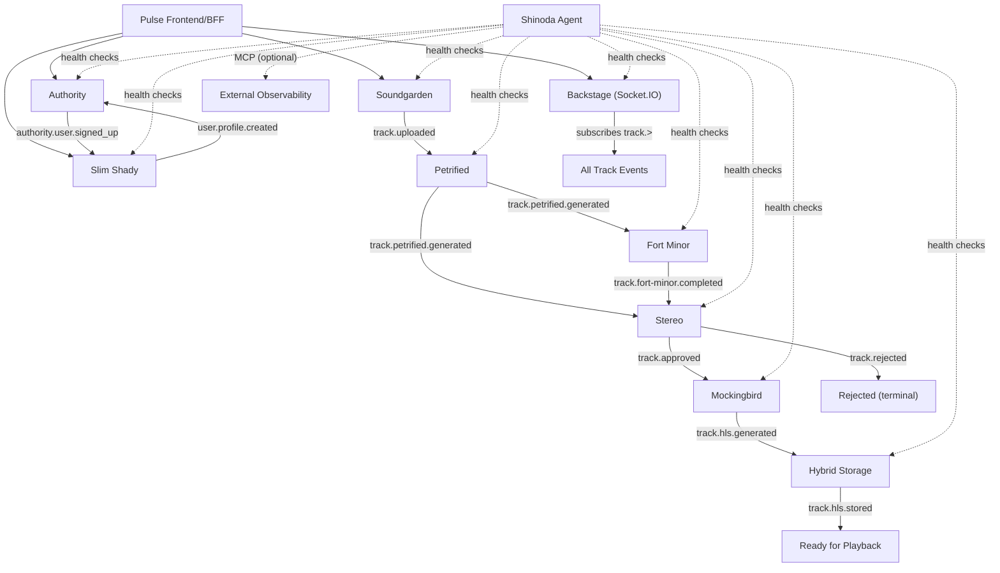

# Pulse Platform — System Architecture Context

## Overview

**Pulse** is a monorepo-based music platform and architecture-learning project built around:

- event-driven microservices
- Clean Architecture with Ports and Adapters
- media ingestion and processing pipelines
- realtime developer-facing observability
- a Next.js frontend that also acts as a lightweight BFF
- an AI agent for operational intelligence

The repository experiments with the idea of filtering music through an AI-assisted pipeline, including the recurring "pre-2000" product rule seen in UI copy and docs. That rule should be treated as a **product experiment**, not as a hard platform invariant. The current codebase models the rule through pipeline decisions, but the end-to-end enforcement and playback lifecycle are still incomplete.

This document describes **how the repository works today**, and calls out where the current implementation is still ahead of or behind the intended architecture.

---

## Monorepo Topology

Pulse is organized as a **pnpm workspace** with **Turborepo** coordinating builds and dev workflows.

Workspace structure:

```text
repos/
├── apps/pulse              # Next.js frontend
├── agents/shinoda           # Mastra AI agent
├── packages/
│   ├── kernel               # DDD primitives
│   ├── event-inventory      # NATS event enums
│   ├── env-orchestration  # Env helpers + docker-compose
│   ├── nats-broker-messaging     # NATS transport layer
│   ├── cache                # Redis cache abstraction
│   ├── patterns             # Circuit breaker, UniqueEntityId
│   └── neon-tokens          # Design tokens (OKLCH)
└── domain/
    ├── identity/
    │   ├── authority         # Auth service
    │   └── slim-shady        # User profile service
    ├── ai/
    │   ├── petrified         # Audio fingerprinting
    │   ├── fort-minor        # AI transcription
    │   └── stereo            # AI reasoning
    ├── streaming/
    │   ├── soundgarden       # Upload/ingestion
    │   ├── mockingbird       # HLS transcoding
    │   └── hybrid-storage    # HLS persistence
    └── realtime/
        └── backstage         # Pipeline observability
```

Key repository characteristics:

- `apps/pulse` is the main Next.js application.
- `packages/*` contains reusable backend primitives such as kernel abstractions, event-bus wiring, environment helpers, patterns, cache, and shared styling.
- `domain/*/*` contains the deployable services (9 microservices).
- `agents/shinoda` is the Mastra-based AI operations agent.
- `repos/packages/env-orchestration/docker-compose.yml` models the local platform topology.

---

## Architectural Conventions

### Bounded Context Services

Runtime services are separated by domain responsibility:

- identity (Authority, Slim Shady)
- streaming (Soundgarden, Mockingbird, Hybrid Storage)
- AI cognition (Petrified, Fort Minor, Stereo)
- realtime observation (Backstage)
- frontend edge/BFF (Pulse)

Each service owns its own `infra` layer, persistence, and infrastructure containers. Shared abstractions live in `packages/*`, not inside another service's implementation.

### Per-Micro Infrastructure

Every microservice has its own dedicated infrastructure:

- **MongoDB**: `authority-mongo`, `slim-shady-mongo`, `stereo-mongo`, `backstage-mongo`
- **Redis**: `petrified-redis`, `fort-minor-redis`
- **MinIO**: `soundgarden-minio`, `mockingbird-minio`, `hybrid-storage-minio`, `petrified-minio`, `fort-minor-minio`
- **NATS**: shared event plane (the only shared infrastructure)

### Clean Architecture Per Service

Microservices follow the repository's standard structure:

```text
application/
domain/
infra/
interface/
```

Layer responsibilities:

| Layer | Responsibility |
| --- | --- |
| `domain` | entities, value objects, events, ports |
| `application` | use cases and service orchestration |
| `infra` | database, event-bus, storage, resilience, config adapters |
| `interface` | HTTP controllers, consumers, guards, DTOs, gateways, pipes |

### Shared Architectural Rules

- ports are **abstract classes**, not TypeScript interfaces
- use cases extend `UseCase` from `@pack/kernel`
- entities extend `DomainEntity` or `AggregateRoot`
- value objects extend `ValueObject`
- NATS wiring is implemented through `@pack/nats-broker-messaging`
- event subjects are defined in `@pack/event-inventory`
- environment variables are accessed via `@pack/env-orchestration`
- service-local path aliases follow:
  - `@application/*`
  - `@domain/*`
  - `@infra/*`
  - `@interface/*`

### Transport Model

Pulse uses multiple communication styles, each for a different concern:

- **HTTP** for external control-plane access and frontend-to-service/BFF requests
- **NATS** for backend asynchronous workflow orchestration
- **Socket.IO** for realtime pipeline visibility to the frontend

The backend pipeline is event-driven, but the overall platform is **not** purely asynchronous. The frontend and BFF intentionally use synchronous HTTP.

---

## Shared Packages

### `@pack/kernel`

Core domain vocabulary for backend services: `UseCase`, `DomainEntity`, `AggregateRoot`, `ValueObject`, `DomainEvent`, `EventBus`, `EventMap`, `Id`, `UnitOfWork`, `DomainError`.

### `@pack/event-inventory`

Centralised NATS event subject enums: `AuthorityEvent`, `UserEvent`, `TrackEvent`. Single source of truth for all event names.

### `@pack/nats-broker-messaging`

NATS transport layer: `NatsPublisher`, `NatsConsumer`, `NatsEventBusAdapter`, NestJS integration (`natsConnectionProvider`, `NatsLifecycleService`, `@EventConsumer`), error hierarchy, middleware.

### `@pack/env-orchestration`

Environment access helpers (`requireStringEnv`, `requireNumberEnv`, `optionalStringEnv`, `optionalNumberEnv`) and the Docker Compose topology for local development.

### `@pack/patterns`

Resilience patterns: `CircuitBreaker` with state machine, `UniqueEntityId` factory.

### `@pack/cache`

Cache abstraction: `CachePort` (abstract class) + `RedisCacheAdapter`.

### `@pack/neon-tokens`

OKLCH-based neon design tokens for the Pulse frontend.

---

## Runtime Services

### Service Inventory

| Service | Domain | Primary Role | Transport Surface | Primary Persistence |
| --- | --- | --- | --- | --- |
| `Authority` | Identity | authentication and session authority | HTTP, NATS | MongoDB (authority-mongo) |
| `Slim Shady` | Identity | user profile service | HTTP, NATS | MongoDB (slim-shady-mongo) |
| `Soundgarden` | Streaming | upload and ingestion edge | HTTP, NATS | local disk + MinIO (soundgarden-minio) |
| `Petrified` | AI | audio fingerprinting and duplicate detection | NATS | Redis (petrified-redis), MinIO (petrified-minio) |
| `Fort Minor` | AI | audio transcription (Whisper) | NATS | Redis (fort-minor-redis), MinIO (fort-minor-minio) |
| `Stereo` | AI | AI reasoning and track approval/rejection | NATS | MongoDB (stereo-mongo) |
| `Mockingbird` | Streaming | HLS transcoding | NATS | MinIO (mockingbird-minio) |
| `Hybrid Storage` | Streaming | HLS persistence sink | NATS | MinIO (hybrid-storage-minio) |
| `Backstage` | Realtime | pipeline projection and websocket broadcast | HTTP, Socket.IO, NATS | MongoDB (backstage-mongo) |
| `Pulse` | Frontend/BFF | UI, auth, upload, proxy routes | HTTP, Socket.IO client | browser/Jotai state |
| `Shinoda` | Agent | operational intelligence, health monitoring | HTTP | — |

---

## Runtime Flow (Current)



---

## Data And Storage Boundaries

### MongoDB

Per-micro MongoDB ownership:

| Service | Container | Database |
| --- | --- | --- |
| Authority | `authority-mongo` | `pulse-authority` |
| Slim Shady | `slim-shady-mongo` | `pulse-slim-shady` |
| Stereo | `stereo-mongo` | `stereo` |
| Backstage | `backstage-mongo` | `backstage` |

### Redis

| Service | Container | Purpose |
| --- | --- | --- |
| Petrified | `petrified-redis` | Audio hashes, idempotency |
| Fort Minor | `fort-minor-redis` | Idempotency |

### MinIO / Object Storage

| Service | Container | Bucket |
| --- | --- | --- |
| Soundgarden | `soundgarden-minio` | `uploads` |
| Petrified | `petrified-minio` | `fingerprints` |
| Fort Minor | `fort-minor-minio` | `transcripts` |
| Mockingbird | `mockingbird-minio` | `transcoded` |
| Hybrid Storage | `hybrid-storage-minio` | `transcoded` |

### NATS

NATS is the shared backend asynchronous workflow plane. It carries identity lifecycle events, upload lifecycle events, AI cognition events, transcoding/HLS events, and pipeline observation inputs for Backstage.

---

## Health Monitoring & Observability

All 9 microservices expose a standard `GET /health` endpoint returning `{ status: 'ok' }`.

The **Shinoda** agent provides two workflows:
- **Health Pipeline**: checks all services in parallel, emits `SERVICE_UNHEALTHY` signals
- **Debug Pipeline**: diagnoses stuck/failed tracks through a 4-step workflow

Signals can optionally be forwarded to an external MCP (Model Context Protocol) server for integration with OpenTelemetry, bug trackers, or alerting platforms.

---

## Implementation Gaps And Future Intent

### Current Gaps

- frontend auth is still partially mock-driven
- playback and catalog state are still partially mock-driven
- some BFF/auth call paths are transitional rather than fully normalized
- local/no-object-storage execution paths can allow uploads to succeed while downstream AI stages do not run

### Future Intent

- a more complete end-to-end streaming pipeline
- stronger event-contract normalization
- cleaner separation between current runtime and mocked UI behavior
- more production-like auth and playback wiring
- a fully connected HLS/storage/delivery stage
