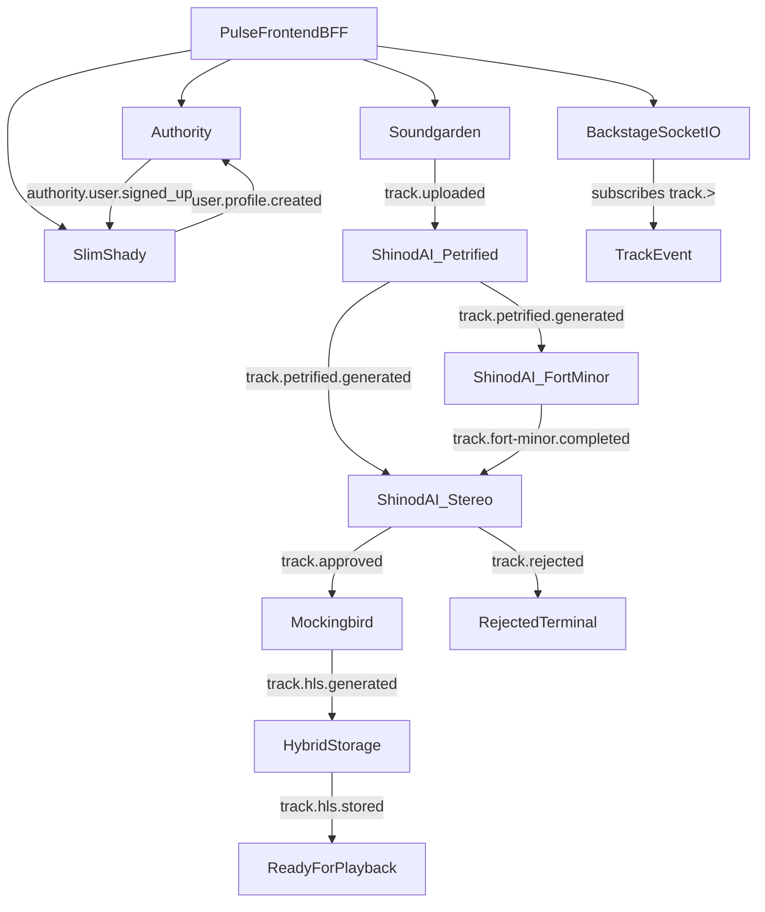

# Pulse Platform — System Architecture Context

## Overview

**Pulse** is a monorepo-based music platform and architecture-learning project built around:

- event-driven microservices
- Clean Architecture with Ports and Adapters
- media ingestion and processing pipelines
- realtime developer-facing observability
- a Next.js frontend that also acts as a lightweight BFF

The repository experiments with the idea of filtering music through an AI-assisted pipeline, including the recurring "pre-2000" product rule seen in UI copy and docs. That rule should be treated as a **product experiment**, not as a hard platform invariant. The current codebase models the rule through pipeline decisions, but the end-to-end enforcement and playback lifecycle are still incomplete.

This document describes **how the repository works today**, and calls out where the current implementation is still ahead of or behind the intended architecture. Product purpose remains the same as in the project tagline: a music platform that intentionally rejects post-2000 songs as part of its pipeline experiment.

---

## Monorepo Topology

Pulse is organized as a **pnpm workspace** with **Turborepo** coordinating builds and dev workflows.

Workspace structure:

```text
apps/*                 # frontend applications
packages/*             # shared architectural/runtime packages
domain/*/*             # runtime services
domain/*/*/*           # nested domain packages/modules
agents/*               # agent-specific assets and helpers
```

Key repository characteristics:

- `apps/pulse` is the main Next.js application.
- `packages/*` contains reusable backend primitives such as kernel abstractions, event-bus wiring, environment helpers, patterns, cache, and shared styling.
- `domain/*/*` contains the deployable services.
- `docker-compose.yml` models the local platform topology.

Turborepo and pnpm are not incidental tooling here; they are part of the architecture:

- pnpm defines workspace-level dependency boundaries.
- Turbo makes shared packages first-class build inputs for all services.
- Each microservice is independently buildable but uses the same shared architectural vocabulary.

---

## Architectural Conventions

### Bounded Context Services

Runtime services are separated by domain responsibility:

- identity
- streaming
- AI cognition
- realtime observation
- frontend edge/BFF

Each service owns its own `infra` layer and persistence concerns. Shared abstractions live in `packages/*`, not inside another service's implementation.

### Clean Architecture Per Service

Microservices follow the repository's standard structure:

```text
application/
domain/
infra/
interface/
```

Layer responsibilities:

| Layer | Responsibility |
| --- | --- |
| `domain` | entities, value objects, events, ports |
| `application` | use cases and service orchestration |
| `infra` | database, event-bus, storage, resilience, config adapters |
| `interface` | HTTP controllers, consumers, guards, DTOs, gateways, pipes |

### Shared Architectural Rules

The current backend conventions are shaped by the repository guidelines and shared packages:

- ports are **abstract classes**, not TypeScript interfaces
- use cases extend `UseCase` from `@pack/kernel`
- entities extend `Entity` or `AggregateRoot`
- value objects extend `ValueObject`
- typed event maps extend `EventMap`
- NATS wiring is implemented through `@pack/event-bus`
- service-local path aliases follow:
  - `@application/*`
  - `@domain/*`
  - `@infra/*`
  - `@interface/*`

### Transport Model

Pulse uses multiple communication styles, each for a different concern:

- **HTTP** for external control-plane access and frontend-to-service/BFF requests
- **NATS** for backend asynchronous workflow orchestration
- **Socket.IO** for realtime pipeline visibility to the frontend

The backend pipeline is event-driven, but the overall platform is **not** purely asynchronous. The frontend and BFF intentionally use synchronous HTTP.

---

## Shared Packages

The shared packages are central to the architecture because they standardize how services are built.

### `@pack/kernel`

Core domain vocabulary for backend services:

- `UseCase`
- `Entity`
- `AggregateRoot`
- `ValueObject`
- `Event`
- `EventBus`
- `UniqueEntityId`
- `EventMap`

This package is what makes service internals structurally consistent across domains.

### `@pack/event-bus`

Shared event-bus infrastructure on top of NATS:

- `NatsEventBusAdapter`
- queue consumer adapter
- connection provider token
- lifecycle drain service
- no-op event-bus fallback

Current subject behavior is simple and important:

- the NATS subject is the **event name string itself**
- `emit('track.uploaded', payload)` publishes to NATS subject `track.uploaded`

### `@env/lib`

Shared environment access helpers such as:

- `requireStringEnv`
- `requireNumberEnv`
- `optionalStringEnv`
- `optionalNumberEnv`

These helpers are used in service bootstrap and configuration wiring.

### `@pack/patterns`

Shared resilience primitives, currently focused on circuit breakers for **synchronous** boundaries such as:

- OAuth verification
- session/persistence wrappers
- other direct service/client calls

Circuit breakers are **not** intended for fire-and-forget event emission.

### `@pack/cache`

Shared cache abstraction and Redis-backed adapter. It exists architecturally, but current adoption in the runtime services is limited.

### `@pack/neon`

Shared styling/theming package used by the frontend. It shapes presentation rather than backend design.

---

## Runtime Services

### Service Inventory

| Service | Domain | Primary Role | Transport Surface | Primary Persistence |
| --- | --- | --- | --- | --- |
| `Authority` | Identity | authentication and session authority | HTTP, NATS | MongoDB |
| `Slim Shady` | Identity | user profile service | HTTP, NATS | MongoDB |
| `Soundgarden` | Streaming | upload and ingestion edge | HTTP, NATS | local disk + object storage |
| `Shinod AI` | AI Cognition | fingerprinting, transcription, reasoning | HTTP health, NATS | MongoDB, Redis, object storage |
| `Mockingbird` | Streaming | MP3 transcoding worker | HTTP health, NATS | object storage + temp files |
| `Hybrid Storage` | Streaming | HLS artifact persistence sink | HTTP health, NATS | object storage + temp files |
| `Backstage` | Realtime | pipeline projection and websocket broadcast | HTTP, Socket.IO, NATS | MongoDB |
| `Pulse` | Frontend/BFF | UI, auth forms, upload UX, proxy routes | HTTP, Socket.IO client | browser/Jotai state |

### Identity Domain

#### Authority

Authority owns authentication concerns:

- signup
- login
- logout
- refresh token rotation
- Google auth
- `/authority/me`
- session issuance and JWT creation
- auth user persistence

Authority emits identity lifecycle events:

- `authority.user.signed_up`
- `authority.user.logged_in`
- `authority.token.refreshed`
- `authority.user.logged_out`

Authority also consumes:

- `user.profile.created`

That inbound event is used to backfill `profileId` onto the auth user record.

#### Slim Shady

Slim Shady is the user-profile service, not a generic identity orchestrator.

Responsibilities:

- create a profile after identity signup
- expose profile read/update endpoints
- store profile preferences and onboarding state
- serve user profile data to the frontend/BFF
- emit profile lifecycle events

Slim Shady consumes:

- `authority.user.signed_up`

Slim Shady emits:

- `user.profile.created`
- `user.profile.updated`
- `user.profile.deleted` is modeled in the event map but not currently produced

### Streaming Domain

#### Soundgarden

Soundgarden is the ingestion edge.

Responsibilities:

- accept uploads
- validate file shape/type/size
- persist local upload artifacts
- optionally copy source artifacts into object storage
- emit upload lifecycle events

Current upload event set:

- `track.upload.received`
- `track.upload.validated`
- `track.upload.stored`
- `track.uploaded`
- `track.upload.failed`

`track.uploaded` currently carries a transitional payload that may include both:

- new storage fields: `petrifiedStorage`, `fortMinorStorage`
- deprecated compatibility fields: `storage`, `transcriptionStorage`

#### Mockingbird

Mockingbird is the transcoding worker.

Responsibilities:

- consume approved tracks
- download the source object
- transcode to 128 kbps and 320 kbps MP3
- upload the variants into object storage
- emit transcoding lifecycle events

Current emitted events:

- `track.transcoding.started`
- `track.transcoding.completed`
- `track.hls.generated`
- `track.transcoding.failed`

#### Hybrid Storage

Hybrid Storage is currently best understood as an **HLS persistence sink**, not a fully wired HLS generation service.

Responsibilities in the current code:

- consume `track.hls.generated`
- persist HLS playlists/segments to object storage
- expose health endpoints

Current behavior:

- it can self-generate mock HLS packages when `MOCK_MODE` is enabled
- it also persists real upstream `track.hls.generated` packages and emits `track.hls.stored`

### AI Cognition Domain

#### Shinod AI

Shinod AI is one deployable service containing multiple event-driven modules:

- `Petrified`
- `Fort Minor`
- `Stereo`

This service is internally modularized like a mini platform. The modules behave like internal workers that coordinate through events and shared state.

##### Petrified

Petrified is responsible for:

- fingerprint generation
- audio hash generation
- duplicate detection
- storage handoff for downstream stages

Current outbound events:

- `track.petrified.generated`
- `track.petrified.song.unknown`
- `track.duplicate.detected`
- `track.petrified.failed`

##### Fort Minor

Fort Minor is responsible for:

- transcription
- language detection
- segment extraction
- transcription completion/failure signaling

Current outbound events:

- `track.fort-minor.started`
- `track.fort-minor.completed`
- `track.fort-minor.failed`

##### Stereo

Stereo is the reasoning layer.

Responsibilities:

- wait until fingerprint and transcription state are both ready
- run AI reasoning over the combined signals
- emit approval or rejection decisions

Current outbound events:

- `track.stereo.started`
- `track.approved`
- `track.rejected`
- `track.stereo.failed`

Important current note:

- `track.approved` now carries explicit source storage references for downstream transcoding

### Realtime Domain

#### Backstage

Backstage is more than a notification relay. It is the pipeline observability service.

Responsibilities:

- subscribe to pipeline events from NATS using wildcard `track.>`
- record per-track pipeline history in MongoDB
- expose HTTP read models under `/pipelines`
- broadcast normalized pipeline updates to clients over Socket.IO namespace `/pipeline`

Backstage emits websocket messages with event name:

- `pipeline.event`

Backstage also contains a mock event generator for local UI development. Some of those mock events are not produced by any real runtime service.

---

## Frontend And BFF Architecture

### Pulse Frontend

`apps/pulse` is a Next.js App Router application with a route-group and parallel-slot layout strategy.

Key structural patterns:

- public auth routes under `(public)/(auth)`
- protected player shell under `(protected)/(player)`
- parallel player slots:
  - `@gallery`
  - `@uploader`
  - `@user-menu`
  - `@now-playing`

The root layout installs a global Jotai provider.

### BFF Layer

The frontend also acts as a lightweight BFF through `app/api`.

Current BFF/proxy routes include:

- authority login
- authority signup
- slim-shady profile lookup/update
- soundgarden track upload

These routes typically:

- create or forward `x-request-id`
- validate request bodies in the auth flows
- proxy requests to backend services
- normalize errors for the UI

### Frontend State Model

The frontend uses:

- Jotai for local UI/application state
- local domain interfaces under `app/lib/state/domain`
- route-local form logic with Zod validation

Important current caveat:

- several parts of the frontend still rely on mock state and hard-coded auth flags
- some playback behavior is still simulated rather than fully driven by backend media state

### Realtime Frontend Integration

The uploader/reasoning UI connects to Backstage through Socket.IO:

- websocket base URL from `NEXT_PUBLIC_BACKSTAGE_WS_URL`
- namespace from `NEXT_PUBLIC_BACKSTAGE_WS_NAMESPACE`
- event stream consumed as `pipeline.event`

This realtime path exists today, but parts of the reasoning UI are still gated by mock/local state.

---

## Data And Storage Boundaries

### MongoDB

Current Mongo ownership is service-specific:

- `Authority`: auth users and sessions
- `Slim Shady`: profiles
- `Backstage`: pipeline projections and history
- `Shinod AI`: cognition/state storage

The current Docker topology uses more than one Mongo instance:

- `mongo`
- `mongo-shinod-ai`

### Redis

Redis is currently associated with the Shinod AI service and related cognition support concerns.

Typical uses:

- idempotency/state acceleration
- cache-like lookup support
- AI pipeline operational state

### NATS

NATS is the backend asynchronous workflow plane.

It carries:

- identity lifecycle events
- upload lifecycle events
- AI cognition events
- transcoding and HLS-related events
- pipeline observation inputs for Backstage

### MinIO / Object Storage

Current object-storage usage is split by stage, but some naming is still transitional.

Common buckets seen in the repo and compose setup:

- `uploads`
- `fingerprints`
- `transcripts`
- `artifacts`
- `transcoded`

Important caveat:

- some services and env templates still reference bucket/key layouts that do not line up perfectly with the architecture doc
- `tracks` versus `uploads` naming is still transitional in parts of the repo

### Local Temporary Storage

Several services use local temp directories as staging areas:

- `/tmp/uploads`
- `/tmp/hls`
- service-specific `/tmp/*` files for download/transcoding work

This is part of the current runtime design and should not be mistaken for durable storage.

---

## Event Architecture And Naming

### Current Event Naming Reality

The codebase already follows a strong convention of **lowercase dot-delimited subjects**, for example:

- `track.uploaded`
- `track.transcoding.completed`
- `user.profile.created`
- `authority.token.refreshed`

However, naming is not fully normalized yet.

Current inconsistencies include:

- underscores in identity events:
  - `authority.user.signed_up`
  - `authority.user.logged_in`
- hyphenated stage names:
  - `track.fort-minor.completed`
- mock-only Backstage subjects that are not emitted by real services

### Recommended Naming Pattern

For current and future event contracts, the repository should treat these patterns as the canonical shape:

- domain events:
  - `<domain>.<entity>.<state>`
  - example: `authority.user.signed_up`
- nested entity events:
  - `<entity>.<subentity>.<state>`
  - example: `user.profile.updated`
- pipeline events:
  - `track.<stage>.<state>`
  - example: `track.upload.received`

### Event Payload Expectations

Async event payloads should consistently include:

- aggregate identifier such as `trackId`, `userId`, or `profileId`
- a timestamp field
- artifact references when a downstream worker needs them

This is an area where some current events are stronger than others.

### Event Inventory

#### Identity Events

- `authority.user.signed_up`
- `authority.user.logged_in`
- `authority.token.refreshed`
- `authority.user.logged_out`
- `user.profile.created`
- `user.profile.updated`
- `user.profile.deleted` is modeled but not currently emitted

#### Upload / Ingestion Events

- `track.upload.received`
- `track.upload.validated`
- `track.upload.stored`
- `track.uploaded`
- `track.upload.failed`

#### AI Cognition Events

- `track.petrified.generated`
- `track.petrified.song.unknown`
- `track.duplicate.detected`
- `track.petrified.failed`
- `track.fort-minor.started`
- `track.fort-minor.completed`
- `track.fort-minor.failed`
- `track.stereo.started`
- `track.approved`
- `track.rejected`
- `track.stereo.failed`

#### Transcoding / HLS Events

- `track.transcoding.started`
- `track.transcoding.completed`
- `track.transcoding.failed`
- `track.hls.generated`
- `track.hls.stored`

#### Realtime Observation Events

- Backstage subscribes to `track.>`
- Backstage broadcasts `pipeline.event` over Socket.IO

---

## Runtime Flow (Current)

The real runtime is best understood as an event graph rather than a single linear chain.



### Identity Flow

1. frontend calls Authority for signup/login
2. Authority emits `authority.user.signed_up`
3. Slim Shady creates the profile
4. Slim Shady emits `user.profile.created`
5. Authority backfills `profileId`

### Upload And AI Flow

1. frontend uploads through Soundgarden
2. Soundgarden emits upload lifecycle events
3. `track.uploaded` triggers Petrified
4. Petrified generates fingerprint/audio-hash state
5. Fort Minor produces transcription
6. Stereo waits for both signals, then decides approval or rejection

### Transcoding And HLS Flow

1. approved tracks flow into Mockingbird
2. Mockingbird transcodes MP3 variants
3. Mockingbird emits `track.hls.generated`
4. Hybrid Storage persists HLS artifacts and emits `track.hls.stored`

### Realtime Observation Flow

1. Backstage subscribes to all `track.*` subjects
2. it records the pipeline history
3. it broadcasts `pipeline.event` to the frontend

---

## Implementation Gaps And Future Intent

This section is intentionally explicit so the architecture doc remains honest as the repo evolves.

### Current Gaps

- Shinod AI remains one deployable service even though the stage contracts are now better isolated.
- `track.ready` exists in Backstage mock flows, but not in current real producers
- frontend auth is still partially mock-driven
- playback and catalog state are still partially mock-driven
- some BFF/auth call paths are transitional rather than fully normalized
- local/no-object-storage execution paths can allow uploads to succeed while downstream AI stages do not run

### Future Intent

The repository is clearly aiming toward:

- a more complete end-to-end streaming pipeline
- stronger event-contract normalization
- cleaner separation between current runtime and mocked UI behavior
- more production-like auth and playback wiring
- a fully connected HLS/storage/delivery stage

Those are good architectural directions, but they should be documented as **intent**, not as already-shipped platform behavior.
