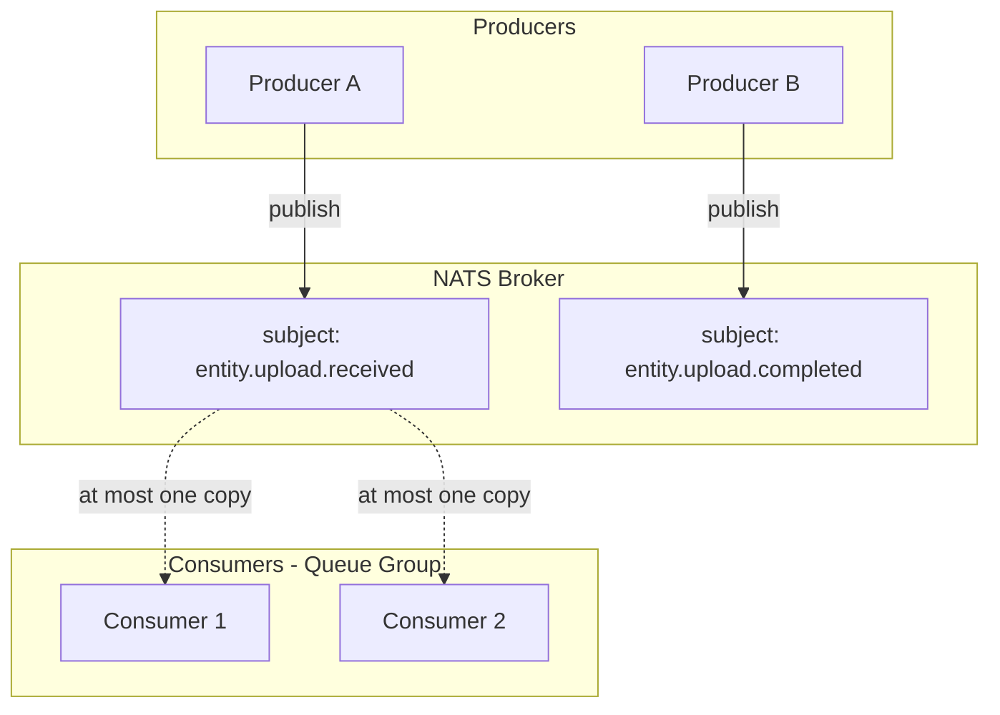
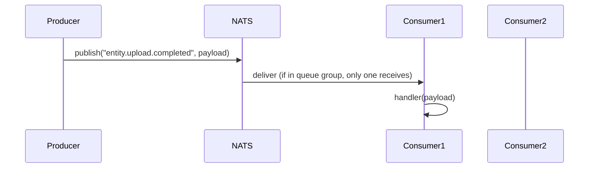

# Event Architecture Guidelines

Events are the primary mechanism for cross-module communication. This document defines naming conventions, envelope structure, payload conventions, mapping patterns, and broker flow. It is service-agnostic so implementations can evolve without changing this spec.

## Table of Contents

- [1. Event Naming Convention](#1-event-naming-convention)
- [2. Payload Conventions](#2-payload-conventions)
- [3. Event Envelope Structure](#3-event-envelope-structure)
- [4. Correlation ID (Pipeline Tracking)](#4-correlation-id-pipeline-tracking)
- [5. Domain Separation](#5-domain-separation)
- [6. Standard Event States](#6-standard-event-states)
- [7. Architecture Context](#7-architecture-context)
- [8. Mapping Events](#8-mapping-events)
- [9. Dispatching Events](#9-dispatching-events)
- [10. Subscribing to Events](#10-subscribing-to-events)
- [11. NATS Broker Flow](#11-nats-broker-flow)
- [12. Optional UI Metadata](#12-optional-ui-metadata)
- [13. Golden Rule](#13-golden-rule)

---

## 1. Event Naming Convention

Events represent **facts that already happened**. They are emitted only when something is **concluded**. The final segment of the event name must always be in the **past tense**.

**Format:**

```
<domain>.<entity>.<state>
```

**Examples:**

- `entity.upload.received`
- `entity.upload.validated`
- `entity.storage.stored`
- `entity.processing.completed`
- `auth.user.signed_up`

### Rules

**Rule 1:** The final word must be past tense. Events describe something that has already occurred.

| Correct | Wrong |
|---------|-------|
| `entity.upload.received` | `entity.upload.receive` |
| `entity.upload.validated` | `entity.validate` |
| `entity.processing.completed` | `entity.processing.complete` |
| `entity.processing.started` | `entity.processing.start` |

**Rule 2:** Never emit ambiguous final states.

Avoid `entity.ready` because it does not describe what happened. Prefer `entity.stored` or `entity.processing.completed`.

**Rule 3:** Event structure should follow `process → state`.

| Correct | Wrong |
|---------|-------|
| `entity.upload.received` | `entity.received.upload` |
| `entity.upload.validated` | |
| `entity.upload.stored` | |

**Rule 4:** Use `failed` for errors (past tense).

- `entity.upload.failed`
- `entity.processing.failed`
- `entity.storage.failed`

**Rule 5:** Use `started` / `completed` for long async tasks (both past participles).

- `entity.processing.started`
- `entity.processing.completed`

---

## 2. Payload Conventions

Every module defines its own payloads, but these conventions improve consistency and traceability across the system.

### Recommended Properties

| Property | Type | When to use |
|----------|------|-------------|
| `entityId` | `string` | Identifier of the entity the event concerns. Use domain-specific names (`trackId`, `userId`, etc.) where appropriate. |
| `*At` timestamp | `string` (ISO 8601) | Moment the fact occurred. Suffix matches the event state: `receivedAt`, `validatedAt`, `storedAt`, `completedAt`, `generatedAt`, `approvedAt`, `rejectedAt`, `startedAt`. |
| `errorCode` | `string` | For failure events. Machine-readable code (e.g. `PROCESSING_FAILED`). |
| `message` | `string` | For failure events. Human-readable description. |
| `reason` | `string` | For decision events (approved/rejected). Explains the outcome. |
| `storage` | `{ bucket: string; key: string }` | When the event references stored artifacts. |

### Example Payloads

**Success (completed):**

```typescript
{
  entityId: string
  completedAt: string  // ISO 8601
  // ... domain-specific fields
}
```

**Failure:**

```typescript
{
  entityId: string
  errorCode: string
  message: string
}
```

**Decision (approved/rejected):**

```typescript
{
  entityId: string
  decision: 'approved' | 'rejected'
  reason: string
  approvedAt?: string  // or rejectedAt
}
```

---

## 3. Event Envelope Structure

All events must follow the same base schema:

```json
{
  "event": "entity.processing.completed",
  "version": 1,
  "producer": "producer-id",
  "timestamp": "2026-03-14T18:12:21Z",
  "correlationId": "pipeline-uuid",
  "data": {}
}
```

| Field | Description |
|-------|-------------|
| `event` | Event name (used as broker subject) |
| `version` | Schema version |
| `producer` | Producer identifier (opaque; can be module name, instance id, etc.) |
| `timestamp` | ISO timestamp |
| `correlationId` | Pipeline or workflow tracing id |
| `data` | Event payload |

---

## 4. Correlation ID (Pipeline Tracking)

Every pipeline or workflow must have a `correlationId` (e.g. UUID). All events in that pipeline share this value so downstream consumers can reconstruct the flow.

**Example flow:**

```
entity.upload.received
entity.ingestion.completed
entity.analysis.completed
entity.approval.completed
entity.processing.completed
entity.storage.stored
```

---

## 5. Domain Separation

Event domains must match responsibility. Use prefixes to separate concerns:

| Domain Prefix | Purpose |
|---------------|---------|
| `entity.*` | Entity lifecycle (upload, storage, processing) |
| `auth.*` | Authentication and session lifecycle |

---

## 6. Standard Event States

To keep things consistent, these states are allowed:

| Lifecycle | Process | Decisions |
|-----------|---------|-----------|
| `received` | `started` | `approved` |
| `validated` | `completed` | `rejected` |
| `stored` | `failed` | |

---

## 7. Architecture Context

The event system is built on shared packages. Kernel is the source of truth; event-bus re-exports and implements.

| Package | Export | Role |
|---------|--------|------|
| `@pack/kernel` | `EventPayload` | Base constraint (`object`) for all payloads. Recommended: `entityId`, `occurredAt`. |
| `@pack/kernel` | `EventMap` | Type alias `Record<string, EventPayload>`. Event maps extend this. |
| `@pack/kernel` | `EventBus` | Abstract class: `emit(event, payload)` and `on(event, handler)`. Adapters implement this contract. |
| `@pack/kernel` | `Event` | Abstract base for domain event value objects (used with `AggregateRoot` for event sourcing). Payload extends `EventPayload`. |
| `@pack/event-bus` | `EventMap`, `EventBus` | Re-exports from kernel. |
| `@pack/event-bus` | `EventHandler` | Handler type; payload generic extends `EventPayload`. |
| `@pack/event-bus` | `NatsEventBusAdapter` | Concrete adapter. Implements `EventBus`. |
| `@pack/event-bus` | `NatsQueueConsumerAdapter` | Concrete adapter for queue-group subscriptions. |

**Flow:** Modules depend on `EventBus<EventMap>` (from `@pack/kernel`). Infrastructure wires `NatsEventBusAdapter` or `NatsQueueConsumerAdapter` (from `@pack/event-bus`) to satisfy that port.

---

## 8. Mapping Events

Define event types as a map from event name to payload. Extend `EventMap` from `@pack/kernel` or `@pack/event-bus` (re-export). Use separate maps for inbound vs outbound if a module has distinct roles.

**Outbound events (this module emits):**

```typescript
import type { EventMap } from '@pack/kernel'

// EventMap is Record<string, EventPayload> — extend with concrete event names and payloads

export interface OutboundEventMap extends EventMap {
  'entity.processing.started': {
    entityId: string
    startedAt: string
  }
  'entity.processing.completed': {
    entityId: string
    completedAt: string
  }
  'entity.processing.failed': {
    entityId: string
    errorCode: string
    message: string
  }
}
```

**Inbound events (this module consumes):**

```typescript
export interface InboundEventMap extends EventMap {
  'entity.upload.completed': {
    entityId: string
    storage: { bucket: string; key: string }
    completedAt: string
  }
  'entity.analysis.completed': {
    entityId: string
    result: unknown
    completedAt: string
  }
}
```

---

## 9. Dispatching Events

Inject an `EventBus<OutboundEventMap>` (from `@pack/kernel`) and call `emit` with the event name and typed payload. Emit only after the fact has occurred.

```typescript
// After processing completes successfully
await this.eventBus.emit('entity.processing.completed', {
  entityId,
  completedAt: new Date().toISOString()
})

// On failure
await this.eventBus.emit('entity.processing.failed', {
  entityId,
  errorCode: 'PROCESSING_FAILED',
  message: error instanceof Error ? error.message : String(error)
})
```

**Pattern:** Emit fire-and-forget for non-critical paths; await when order or delivery matters.

---

## 10. Subscribing to Events

Use a queue-consumer adapter so multiple instances share work (competing consumers). The broker subject equals the event name.

```typescript
const consumer = new NatsQueueConsumerAdapter<InboundEventMap>(
  connection,
  queueGroupName  // e.g. "workers" — instances with same name share messages
)

consumer.subscribe('entity.upload.completed', async (payload) => {
  await this.handleUploadCompleted(payload)
})

consumer.subscribe('entity.analysis.completed', async (payload) => {
  await this.handleAnalysisCompleted(payload)
})
```

**Pattern:** One subscription per event. Handler receives typed payload. Use queue groups for load balancing.

---

## 11. NATS Broker Flow



### Concepts

| Concept | Description |
|---------|-------------|
| **Subject** | Event name. Producers publish to `subject`; consumers subscribe to `subject`. |
| **Queue group** | Optional. Subscribers with the same queue name form a group; each message is delivered to at most one member. Used for load balancing. |
| **Pub/Sub** | Without a queue group, all subscribers receive every message (fan-out). |

### Flow

1. Producer encodes payload as JSON, publishes to subject = event name.
2. Broker delivers to subscribers. With queue group: round-robin among group members.
3. Consumer decodes payload, invokes handler. Errors in handler do not affect other messages.



---

## 12. Optional UI Metadata

Events may optionally include UI feedback for dashboards or pipelines:

```json
{
  "event": "entity.processing.started",
  "producer": "producer-id",
  "timestamp": "...",
  "data": {},
  "ui": {
    "message": "Processing in progress...",
    "progress": 50
  }
}
```

The `ui` field is optional and consumer-specific. Producers that do not need it may omit it.

---

## 13. Golden Rule

**Events must represent facts, not commands.**

| Correct | Wrong |
|---------|-------|
| `entity.processing.completed` | `process.entity` |
| `entity.storage.stored` | `store.entity` |
