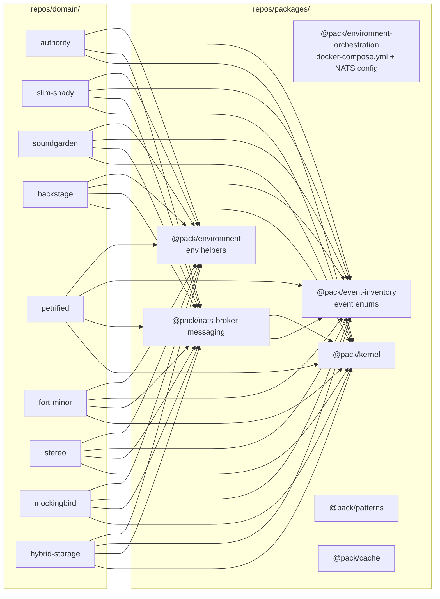
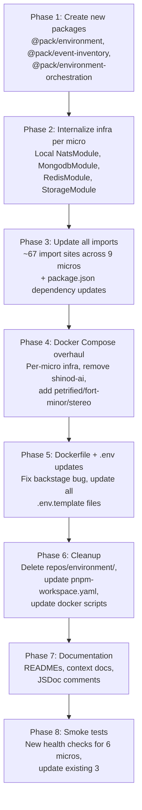

# V1 Workspace Refactoring Plan

> **Goal**: Eliminate the `repos/environment/` workspace entirely, migrate its packages to `repos/packages/`, internalize all shared infrastructure modules into each microservice, overhaul `docker-compose.yml` to give every micro its own infra instances, remove the dead `shinod-ai` monolith, and fully document the new topology.

---

## Table of Contents

- [Current State](#current-state)
- [Target State](#target-state)
- [Phase 1 -- Create New Packages](#phase-1----create-new-packages)
- [Phase 2 -- Internalize Infrastructure Per Microservice](#phase-2----internalize-infrastructure-per-microservice)
- [Phase 3 -- Update All Imports](#phase-3----update-all-imports)
- [Phase 4 -- Docker Compose Overhaul](#phase-4----docker-compose-overhaul)
- [Phase 5 -- Dockerfile and .env Updates](#phase-5----dockerfile-and-env-updates)
- [Phase 6 -- Cleanup](#phase-6----cleanup)
- [Phase 7 -- Documentation](#phase-7----documentation)
- [Phase 8 -- Smoke Tests](#phase-8----smoke-tests)
- [Execution Order](#execution-order)
- [Constraints](#constraints)

---

## Current State

### Workspace: `repos/environment/`

The `repos/environment/` workspace holds three packages:

| Package | Name | Description | Consumers |
|---------|------|-------------|-----------|
| `repos/environment/core/` | `@env/core` | Shared NestJS infra modules (NatsModule, MongodbModule, RedisModule, MinioModule, AudioStoragePort) | petrified, fort-minor, stereo |
| `repos/environment/lib/` | `@env/lib` | Env helpers (requireStringEnv, requireNumberEnv, optionalStringEnv, optionalNumberEnv) | All 9 micros (~24 import sites) |
| `repos/environment/events/event-inventory/` | `@env/event-inventory` | Event-name enums (AuthorityEvent, UserEvent, TrackEvent) | All 9 micros + `@pack/nats-broker-messaging` (~35 import sites) |

### Current `@env/core` Source Files

```
repos/environment/core/src/
├── index.ts                           # Barrel: NatsModule, RedisModule, REDIS_CLIENT, MinioModule, AudioStoragePort, MongodbModule
├── mongodb/
│   ├── mongodb.module.ts              # MongooseModule.forRoot(mongoUri(), { dbName: mongoDbName() })
│   └── mongodb.provider.ts            # mongoUri() and mongoDbName() from requireStringEnv
├── minio/
│   ├── audio-storage.port.ts          # AudioStoragePort abstract class + DownloadedAudio interface
│   ├── minio-audio-storage.adapter.ts # MinioAudioStorageAdapter using S3Client
│   ├── minio.module.ts               # Module providing AudioStoragePort
│   └── minio.provider.ts             # Provider binding AudioStoragePort -> MinioAudioStorageAdapter
├── nats/
│   └── nats.module.ts                # Module wrapping @pack/nats-broker-messaging providers
└── redis/
    ├── redis.module.ts               # Module providing REDIS_CLIENT
    └── redis.provider.ts             # REDIS_CLIENT = new Redis(requireStringEnv('REDIS_URL'))
```

### Current `@env/lib` Source Files

```
repos/environment/lib/src/
├── index.ts                           # Barrel
├── require-string-env.compute.ts      # requireStringEnv(name): string -- throws if missing
├── require-number-env.compute.ts      # requireNumberEnv(name): number -- parses, throws if NaN
├── optional-string-env.compute.ts     # optionalStringEnv(name, defaultValue): string
└── optional-number-env.compute.ts     # optionalNumberEnv(name, defaultValue): number
```

### Current `@env/event-inventory` Source Files

```
repos/environment/events/event-inventory/src/
├── index.ts                           # Barrel: AuthorityEvent, UserEvent, TrackEvent
├── event.map.ts                       # Empty placeholder
└── domain/
    ├── authority.events.enum.ts       # AuthorityEvent (UserSignedUp, UserLoggedIn, TokenRefreshed, UserLoggedOut)
    ├── user.events.enum.ts            # UserEvent (ProfileCreated, ProfileUpdated, ProfileDeleted)
    └── track.events.enum.ts           # TrackEvent (25 members: upload, petrified, fort-minor, stereo, transcoding, HLS)
```

### Current `docker-compose.yml` Problems

Located at `repos/environment/docker-compose.yml`:

1. Still references dead `shinod-ai` monolith service (directory `repos/domain/ai/shinod-ai/` does not exist)
2. Uses **shared** infrastructure:
   - `mongo` shared by authority, slim-shady, backstage
   - `mongo-shinod-ai` shared by the old AI monolith
   - `redis-shinoda` shared by the old AI monolith
   - `minio` shared by soundgarden, mockingbird, hybrid-storage, and AI services
3. Shared volumes (`uploads`, `hls_staging`) create implicit coupling between services
4. Missing individual service entries for petrified, fort-minor, stereo
5. Missing slim-shady and hybrid-storage from `APP_SERVICES` in docker scripts

### Current Docker Script Issues (`bin/docker/*.sh`)

All three scripts reference `$ROOT_DIR/repos/environment/docker/docker-compose.yml` (stale path -- the file was moved to `repos/environment/docker-compose.yml`).

`docker-up.sh`:
- `APP_SERVICES` is missing: `slim-shady`, `hybrid-storage`, `petrified`, `fort-minor`, `stereo`
- `APP_ENV_FILES` references `repos/domain/ai/shinod-ai/.env` which does not exist

`docker-down.sh` / `docker-ps.sh`:
- `APP_SERVICES` is missing the same services as above

### Current Microservice Inventory

| Micro | Location | Port | Dockerfile | Has .env.template | Imports @env/core | Imports @env/lib | Imports @env/event-inventory |
|-------|----------|------|------------|-------------------|-------------------|------------------|------------------------------|
| authority | `repos/domain/identity/authority/` | 7000 | Yes | Yes | No | Yes (8 files) | Yes (8 files) |
| slim-shady | `repos/domain/identity/slim-shady/` | 7400 | Yes | Yes | No | Yes (2 files) | Yes (7 files) |
| soundgarden | `repos/domain/streaming/soundgarden/` | 7100 | Yes | Yes | No | Yes (3 files) | Yes (2 files) |
| backstage | `repos/domain/realtime/backstage/` | 4001 | Yes | Yes | No | Yes (2 files) | Yes (3 files) |
| petrified | `repos/domain/ai/petrified/` | 7201 | Yes | Yes | Yes (5 files) | Yes (2 files) | Yes (3 files) |
| fort-minor | `repos/domain/ai/fort-minor/` | 7202 | Yes | Yes | Yes (4 files) | Yes (3 files) | Yes (2 files) |
| stereo | `repos/domain/ai/stereo/` | 7203 | Yes | Yes | Yes (2 files) | Yes (4 files) | Yes (3 files) |
| mockingbird | `repos/domain/streaming/mockingbird/` | 7200 | Yes | Yes | No | Yes (2 files) | Yes (3 files) |
| hybrid-storage | `repos/domain/streaming/hybrid-storage/` | 7300 | Yes | Yes | No | No | Yes (3 files) |

---

## Target State

### New Package Topology



### Core Principles

- **NO SHARABLE INFRA COMPONENTS** -- every micro owns its MongoDB, Redis, MinIO modules and adapters locally
- **NATS stays shared** -- single event plane for the entire platform
- **Shared code is abstractions only** -- `@pack/kernel` (DDD primitives), `@pack/nats-broker-messaging` (transport), `@pack/event-inventory` (event names), `@pack/environment` (env utilities), `@pack/patterns` (resilience)
- **NEVER modify `@pack/kernel`** -- use its abstractions, don't change them
- **Each micro is independently deployable** -- own Dockerfile, own `.env`, own infra in `docker-compose.yml`

### Target Directory Structure After Refactoring

```
repos/
├── packages/
│   ├── kernel/                        # @pack/kernel (UNCHANGED)
│   ├── nats-broker-messaging/         # @pack/nats-broker-messaging (dep update only)
│   ├── patterns/                      # @pack/patterns (UNCHANGED)
│   ├── cache/                         # @pack/cache (UNCHANGED)
│   ├── neon-tokens/                   # @pack/neon-tokens (UNCHANGED)
│   ├── environment/                   # @pack/environment (NEW -- from @env/lib)
│   ├── event-inventory/               # @pack/event-inventory (NEW -- from @env/event-inventory)
│   └── environment-orchestration/     # @pack/environment-orchestration (NEW -- docker-compose.yml)
├── domain/
│   ├── identity/
│   │   ├── authority/                 # @micro/authority (local MongoDB + NATS infra)
│   │   └── slim-shady/               # @micro/slim-shady (local MongoDB + NATS infra)
│   ├── streaming/
│   │   ├── soundgarden/              # @micro/soundgarden (local MinIO + NATS infra)
│   │   ├── mockingbird/              # @micro/mockingbird (local MinIO + NATS infra)
│   │   └── hybrid-storage/           # @micro/hybrid-storage (local MinIO + NATS infra)
│   ├── ai/
│   │   ├── petrified/                # @micro/petrified (local Redis + MinIO + NATS infra)
│   │   ├── fort-minor/               # @micro/fort-minor (local Redis + MinIO + NATS infra)
│   │   └── stereo/                   # @micro/stereo (local MongoDB + NATS infra)
│   └── realtime/
│       └── backstage/                # @micro/backstage (local MongoDB + NATS infra)
├── apps/
│   └── pulse/                        # Next.js frontend/BFF (UNCHANGED)
└── agents/
    └── shinoda/                      # Agent (UNCHANGED)
```

### Target Docker Compose Topology

```mermaid
flowchart TD
  subgraph shared ["Shared Infrastructure"]
    nats["nats\n:4222 / :8222"]
  end

  subgraph identity ["Identity Infra"]
    authMongo["authority-mongo\n:27017"]
    slimMongo["slim-shady-mongo\n:27018"]
  end

  subgraph streaming ["Streaming Infra"]
    soundMinio["soundgarden-minio\n:9010"]
    mockMinio["mockingbird-minio\n:9020"]
    hybMinio["hybrid-storage-minio\n:9030"]
  end

  subgraph ai ["AI Infra"]
    petRedis["petrified-redis\n:6380"]
    petMinio["petrified-minio\n:9040"]
    fortRedis["fort-minor-redis\n:6381"]
    fortMinio["fort-minor-minio\n:9050"]
    sterMongo["stereo-mongo\n:27019"]
  end

  subgraph realtime ["Realtime Infra"]
    backMongo["backstage-mongo\n:27020"]
  end

  auth["authority :7000"] --> authMongo & nats
  slim["slim-shady :7400"] --> slimMongo & nats
  sound["soundgarden :7100"] --> soundMinio & nats
  back["backstage :4001"] --> backMongo & nats
  pet["petrified :7201"] --> petRedis & petMinio & nats
  fort["fort-minor :7202"] --> fortRedis & fortMinio & nats
  ster["stereo :7203"] --> sterMongo & nats
  mock["mockingbird :7200"] --> mockMinio & nats
  hyb["hybrid-storage :7300"] --> hybMinio & nats
  pulse["pulse :3000"] --> auth
  shinoda["shinoda :4111"] --> back
```



---

## Phase 1 -- Create New Packages

### 1.1 `@pack/environment` (absorbs `@env/lib`)

**Location**: `repos/packages/environment/`

Move the four env-helper files and barrel from `repos/environment/lib/src/` into `repos/packages/environment/src/`. No runtime dependencies -- pure `process.env` utilities.

**`repos/packages/environment/package.json`**:
```json
{
  "name": "@pack/environment",
  "version": "0.1.0",
  "private": true,
  "main": "dist/index.js",
  "types": "dist/index.d.ts",
  "files": ["dist", "src"],
  "exports": {
    ".": {
      "types": "./dist/index.d.ts",
      "default": "./dist/index.js"
    }
  },
  "scripts": {
    "build": "tsc -p tsconfig.build.json"
  },
  "devDependencies": {
    "typescript": "^5",
    "@types/node": "^20"
  }
}
```

**`repos/packages/environment/tsconfig.json`**:
```json
{
  "compilerOptions": {
    "outDir": "dist",
    "rootDir": "src",
    "declaration": true,
    "module": "CommonJS",
    "target": "ES2022",
    "strict": true,
    "esModuleInterop": true
  },
  "include": ["src"]
}
```

**`repos/packages/environment/tsconfig.build.json`**:
```json
{
  "extends": "./tsconfig.json",
  "exclude": ["node_modules", "dist", "test", "**/*.spec.ts"]
}
```

**Target file structure**:
```
repos/packages/environment/
├── package.json
├── tsconfig.json
├── tsconfig.build.json
├── README.md
└── src/
    ├── index.ts
    ├── require-string-env.compute.ts
    ├── require-number-env.compute.ts
    ├── optional-string-env.compute.ts
    └── optional-number-env.compute.ts
```

**`src/index.ts`**:
```typescript
export { requireStringEnv } from './require-string-env.compute'
export { requireNumberEnv } from './require-number-env.compute'
export { optionalStringEnv } from './optional-string-env.compute'
export { optionalNumberEnv } from './optional-number-env.compute'
```

**`src/require-string-env.compute.ts`** (add JSDoc):
```typescript
/**
 * Reads a required string environment variable.
 * Throws immediately at startup if the variable is missing or empty,
 * enforcing the fail-fast convention from GENERAL_CODE_GUIDELINE.
 */
export function requireStringEnv(name: string): string {
  const value = process.env[name]
  if (!value) {
    throw new Error(`Missing required environment variable: ${name}`)
  }
  return value
}
```

**`src/require-number-env.compute.ts`** (add JSDoc):
```typescript
import { requireStringEnv } from './require-string-env.compute'

/**
 * Reads a required numeric environment variable.
 * Delegates to requireStringEnv for presence check, then validates
 * the value parses to a finite number.
 */
export function requireNumberEnv(name: string): number {
  const value = requireStringEnv(name)
  const parsed = Number(value)
  if (!Number.isFinite(parsed)) {
    throw new Error(`Environment variable ${name} must be a valid number`)
  }
  return parsed
}
```

**`src/optional-string-env.compute.ts`** (add JSDoc):
```typescript
/**
 * Reads an optional string environment variable, returning a default
 * when the variable is not set.
 */
export function optionalStringEnv(name: string, defaultValue: string): string {
  return process.env[name] ?? defaultValue
}
```

**`src/optional-number-env.compute.ts`** (add JSDoc):
```typescript
/**
 * Reads an optional numeric environment variable, returning a default
 * when the variable is not set. Throws if the value is present but
 * not a valid finite number.
 */
export function optionalNumberEnv(name: string, defaultValue: number): number {
  const value = process.env[name]
  if (!value) return defaultValue
  const parsed = Number(value)
  if (!Number.isFinite(parsed)) {
    throw new Error(`Environment variable ${name} must be a valid number`)
  }
  return parsed
}
```

---

### 1.2 `@pack/event-inventory` (absorbs `@env/event-inventory`)

**Location**: `repos/packages/event-inventory/`

Move everything from `repos/environment/events/event-inventory/` into the new location. Rename the package from `@env/event-inventory` to `@pack/event-inventory`. Add JSDoc comments to each enum and its members.

**`repos/packages/event-inventory/package.json`**:
```json
{
  "name": "@pack/event-inventory",
  "version": "0.1.0",
  "private": true,
  "main": "dist/index.js",
  "types": "dist/index.d.ts",
  "files": ["dist", "src"],
  "exports": {
    ".": {
      "types": "./dist/index.d.ts",
      "default": "./dist/index.js"
    }
  },
  "scripts": {
    "build": "tsc -p tsconfig.build.json"
  },
  "devDependencies": {
    "typescript": "^5"
  }
}
```

**`repos/packages/event-inventory/tsconfig.json`**:
```json
{
  "compilerOptions": {
    "outDir": "dist",
    "rootDir": "src",
    "declaration": true,
    "module": "CommonJS",
    "target": "ES2022",
    "strict": true,
    "esModuleInterop": true
  },
  "include": ["src"]
}
```

**`repos/packages/event-inventory/tsconfig.build.json`**:
```json
{
  "extends": "./tsconfig.json",
  "exclude": ["node_modules", "dist", "test", "**/*.spec.ts"]
}
```

**Target file structure**:
```
repos/packages/event-inventory/
├── package.json
├── tsconfig.json
├── tsconfig.build.json
├── README.md
└── src/
    ├── index.ts
    ├── event.map.ts
    └── domain/
        ├── authority.events.enum.ts
        ├── user.events.enum.ts
        └── track.events.enum.ts
```

**`src/index.ts`**:
```typescript
export { AuthorityEvent } from './domain/authority.events.enum'
export { UserEvent } from './domain/user.events.enum'
export { TrackEvent } from './domain/track.events.enum'
```

**`src/domain/authority.events.enum.ts`** (add JSDoc):
```typescript
/**
 * NATS subjects emitted by the Authority microservice.
 * These cover the full authentication lifecycle: signup, login,
 * token refresh, and logout.
 */
export enum AuthorityEvent {
  /** Emitted when a new user completes signup (consumed by Slim Shady). */
  UserSignedUp = 'authority.user.signed_up',
  /** Emitted when an existing user logs in (observability only). */
  UserLoggedIn = 'authority.user.logged_in',
  /** Emitted when a JWT access token is refreshed (observability only). */
  TokenRefreshed = 'authority.token.refreshed',
  /** Emitted when a user logs out and the session is destroyed (observability only). */
  UserLoggedOut = 'authority.user.logged_out'
}
```

**`src/domain/user.events.enum.ts`** (add JSDoc):
```typescript
/**
 * NATS subjects emitted by the Slim Shady (user profile) microservice.
 * These cover the user profile lifecycle.
 */
export enum UserEvent {
  /** Emitted after a user profile is created (consumed by Authority for profileId backfill). */
  ProfileCreated = 'user.profile.created',
  /** Emitted when a user profile is updated. */
  ProfileUpdated = 'user.profile.updated',
  /** Emitted when a user profile is deleted (modeled but not currently produced). */
  ProfileDeleted = 'user.profile.deleted'
}
```

**`src/domain/track.events.enum.ts`** (add JSDoc):
```typescript
/**
 * NATS subjects for the track processing pipeline.
 * Covers the full lifecycle: upload, fingerprinting (Petrified),
 * transcription (Fort Minor), reasoning (Stereo), transcoding
 * (Mockingbird), and HLS persistence (Hybrid Storage).
 */
export enum TrackEvent {
  /** Upload received by Soundgarden (Backstage observes). */
  UploadReceived = 'track.upload.received',
  /** Upload validated by Soundgarden (Backstage observes). */
  UploadValidated = 'track.upload.validated',
  /** Upload stored to object storage by Soundgarden (Backstage observes). */
  UploadStored = 'track.upload.stored',
  /** Upload fully completed -- triggers Petrified fingerprinting (consumed by Petrified, Backstage). */
  Uploaded = 'track.uploaded',
  /** Upload failed (Backstage observes). */
  UploadFailed = 'track.upload.failed',

  /** Fingerprint generated by Petrified (consumed by Fort Minor, Stereo, Backstage). */
  PetrifiedGenerated = 'track.petrified.generated',
  /** Song identified by Petrified (Backstage observes). */
  PetrifiedSongFound = 'track.petrified.song.found',
  /** Song not found in fingerprint DB (Backstage observes). */
  PetrifiedSongUnknown = 'track.petrified.song.unknown',
  /** Fingerprint detected/matched (Backstage observes). */
  PetrifiedDetected = 'track.petrified.detected',
  /** Fingerprinting failed (Backstage observes). */
  PetrifiedFailed = 'track.petrified.failed',
  /** Duplicate track detected by Petrified (Backstage observes). */
  DuplicateDetected = 'track.duplicate.detected',

  /** Transcription started by Fort Minor (Backstage observes). */
  FortMinorStarted = 'track.fort-minor.started',
  /** Transcription completed by Fort Minor (consumed by Stereo, Backstage). */
  FortMinorCompleted = 'track.fort-minor.completed',
  /** Transcription failed (Backstage observes). */
  FortMinorFailed = 'track.fort-minor.failed',

  /** AI reasoning started by Stereo (Backstage observes). */
  StereoStarted = 'track.stereo.started',
  /** Track approved by Stereo (consumed by Mockingbird, Backstage). */
  Approved = 'track.approved',
  /** Track rejected by Stereo (Backstage observes). */
  Rejected = 'track.rejected',
  /** AI reasoning failed (Backstage observes). */
  StereoFailed = 'track.stereo.failed',

  /** Transcoding started by Mockingbird (Backstage observes). */
  TranscodingStarted = 'track.transcoding.started',
  /** Transcoding completed by Mockingbird (Backstage observes). */
  TranscodingCompleted = 'track.transcoding.completed',
  /** Transcoding failed (Backstage observes). */
  TranscodingFailed = 'track.transcoding.failed',

  /** HLS package generated by Mockingbird (consumed by Hybrid Storage, Backstage). */
  HlsGenerated = 'track.hls.generated',
  /** HLS package persisted by Hybrid Storage (Backstage observes). */
  HlsStored = 'track.hls.stored',
  /** HLS generation/persistence failed (Backstage observes). */
  HlsFailed = 'track.hls.failed'
}
```

---

### 1.3 `@pack/environment-orchestration` (absorbs `@env/core` orchestration role)

**Location**: `repos/packages/environment-orchestration/`

This is a **non-TypeScript** workspace package. It holds Docker orchestration files only. The NestJS modules that lived in `@env/core` (MongodbModule, RedisModule, MinioModule, NatsModule) are **not** carried over -- they are replaced by per-micro local infra modules (Phase 2).

**Target file structure**:
```
repos/packages/environment-orchestration/
├── package.json
├── .env.template
├── docker-compose.yml
└── README.md
```

**`repos/packages/environment-orchestration/package.json`**:
```json
{
  "name": "@pack/environment-orchestration",
  "version": "0.1.0",
  "private": true
}
```

**`repos/packages/environment-orchestration/.env.template`**:
```env
# Orchestration-level env vars used by docker-compose.yml
# Each micro has its own .env file for service-specific configuration.
MINIO_ROOT_USER=minioadmin
MINIO_ROOT_PASSWORD=minioadmin
```

The `docker-compose.yml` content is detailed in [Phase 4](#phase-4----docker-compose-overhaul).

---

## Phase 2 -- Internalize Infrastructure Per Microservice

### 2.1 Per-Micro Infra Requirements

Each microservice creates local infra wiring in its `src/<service>/infra/` layer. No micro imports infra modules from another package.

| Micro | Needs Mongo | Needs Redis | Needs MinIO/S3 | Needs NATS | Needs AudioStoragePort | Files to Create |
|-------|-------------|-------------|----------------|------------|------------------------|-----------------|
| authority | Yes | No | No | Yes | No | `infra/persistence/mongodb.module.ts`, `infra/nats/nats.module.ts` |
| slim-shady | Yes | No | No | Yes | No | `infra/persistence/mongodb.module.ts`, `infra/nats/nats.module.ts` |
| soundgarden | No | No | Yes (already has local adapter) | Yes | No | `infra/nats/nats.module.ts` |
| backstage | Yes | No | No | Yes | No | `infra/persistence/mongodb.module.ts`, `infra/nats/nats.module.ts` |
| petrified | No | Yes | Yes | Yes | Yes | `infra/redis/redis.module.ts`, `infra/storage/storage.module.ts`, `infra/nats/nats.module.ts`, `domain/ports/audio-storage.port.ts`, `infra/storage/minio-audio-storage.adapter.ts` |
| fort-minor | No | Yes | Yes | Yes | Yes | `infra/redis/redis.module.ts`, `infra/storage/storage.module.ts`, `infra/nats/nats.module.ts`, `domain/ports/audio-storage.port.ts`, `infra/storage/minio-audio-storage.adapter.ts` |
| stereo | Yes | No | No | Yes | No | `infra/persistence/mongodb.module.ts`, `infra/nats/nats.module.ts` |
| mockingbird | No | No | Yes (already has local adapter) | Yes | No | `infra/nats/nats.module.ts` |
| hybrid-storage | No | No | Yes | Yes | No | `infra/nats/nats.module.ts` |

### 2.2 Local NatsModule Pattern

Every micro creates this identical module in `src/<service>/infra/nats/nats.module.ts`:

```typescript
import { Module } from '@nestjs/common'
import {
  NatsConnectionToken,
  natsConnectionProvider,
  NatsLifecycleService
} from '@pack/nats-broker-messaging'

/** Provides a NATS connection and lifecycle drain for this microservice. */
@Module({
  providers: [natsConnectionProvider, NatsLifecycleService],
  exports: [NatsConnectionToken]
})
export class NatsModule {}
```

### 2.3 Local MongodbModule Pattern

For micros that need MongoDB (authority, slim-shady, backstage, stereo), create `src/<service>/infra/persistence/mongodb.module.ts`:

```typescript
import { Module } from '@nestjs/common'
import { MongooseModule } from '@nestjs/mongoose'
import { requireStringEnv } from '@pack/environment'

/** Provides a MongoDB/Mongoose connection scoped to this microservice's own database. */
@Module({
  imports: [
    MongooseModule.forRoot(requireStringEnv('MONGO_URI'), {
      dbName: requireStringEnv('MONGO_DB_NAME')
    })
  ],
  exports: [MongooseModule]
})
export class MongodbModule {}
```

### 2.4 Local RedisModule Pattern

For micros that need Redis (petrified, fort-minor), create `src/<service>/infra/redis/redis.module.ts`:

```typescript
import { Module } from '@nestjs/common'
import Redis from 'ioredis'
import { requireStringEnv } from '@pack/environment'

/** Injection token for the Redis client instance. */
export const REDIS_CLIENT = 'REDIS_CLIENT'

/** Provides a Redis client connected to this microservice's own Redis instance. */
@Module({
  providers: [
    {
      provide: REDIS_CLIENT,
      useFactory: () => new Redis(requireStringEnv('REDIS_URL'))
    }
  ],
  exports: [REDIS_CLIENT]
})
export class RedisModule {}
```

### 2.5 Migrate AudioStoragePort

Currently `AudioStoragePort` and `MinioAudioStorageAdapter` live in `repos/environment/core/src/minio/`. They are used by **petrified** and **fort-minor** only.

**Action for each of these two micros:**

1. Create `src/<service>/domain/ports/audio-storage.port.ts`:

```typescript
/** Result of downloading an audio file from object storage to a temp location. */
export interface DownloadedAudio {
  filePath: string
  cleanup: () => Promise<void>
}

/** Port for downloading audio files from object storage. */
export abstract class AudioStoragePort {
  abstract download(bucket: string, key: string): Promise<DownloadedAudio>
}
```

2. Create `src/<service>/infra/storage/minio-audio-storage.adapter.ts`:

```typescript
import { Injectable } from '@nestjs/common'
import { S3Client, GetObjectCommand, type S3ClientConfig } from '@aws-sdk/client-s3'
import * as fs from 'node:fs'
import * as path from 'node:path'
import * as os from 'node:os'
import type { Readable } from 'node:stream'
import { optionalStringEnv } from '@pack/environment'
import { AudioStoragePort, type DownloadedAudio } from '@domain/ports/audio-storage.port'

function buildS3Client(): S3Client {
  const config: S3ClientConfig = {
    region: optionalStringEnv('STORAGE_REGION', 'us-east-1'),
    credentials: {
      accessKeyId: optionalStringEnv('STORAGE_ACCESS_KEY', 'minioadmin'),
      secretAccessKey: optionalStringEnv('STORAGE_SECRET_KEY', 'minioadmin')
    },
    forcePathStyle: true,
    endpoint: optionalStringEnv('STORAGE_ENDPOINT', 'http://localhost:9000')
  }
  return new S3Client(config)
}

/** Downloads audio from MinIO/S3-compatible object storage to a temp file. */
@Injectable()
export class MinioAudioStorageAdapter extends AudioStoragePort {
  private readonly client = buildS3Client()

  async download(bucket: string, key: string): Promise<DownloadedAudio> {
    const response = await this.client.send(
      new GetObjectCommand({ Bucket: bucket, Key: key })
    )
    const fileName = path.basename(key)
    const tmpDir = await fs.promises.mkdtemp(path.join(os.tmpdir(), 'audio-'))
    const filePath = path.join(tmpDir, fileName)
    const stream = response.Body as Readable
    await new Promise<void>((resolve, reject) => {
      const writer = fs.createWriteStream(filePath)
      stream.pipe(writer)
      writer.on('finish', resolve)
      writer.on('error', reject)
    })
    return {
      filePath,
      cleanup: async () => {
        await fs.promises.rm(tmpDir, { recursive: true, force: true })
      }
    }
  }
}
```

3. Create `src/<service>/infra/storage/storage.module.ts`:

```typescript
import { Module } from '@nestjs/common'
import type { Provider } from '@nestjs/common'
import { AudioStoragePort } from '@domain/ports/audio-storage.port'
import { MinioAudioStorageAdapter } from './minio-audio-storage.adapter'

const storageProvider: Provider = {
  provide: AudioStoragePort,
  useClass: MinioAudioStorageAdapter
}

/** Provides the AudioStoragePort bound to this micro's own MinIO instance. */
@Module({
  providers: [storageProvider],
  exports: [AudioStoragePort]
})
export class StorageModule {}
```

### 2.6 Update App Modules

Each micro's `app.module.ts` (or `<service>.module.ts`) must replace `@env/core` imports with the local infra modules.

**petrified** -- `src/petrified.module.ts`:
```diff
- import { NatsModule, RedisModule, MinioModule } from '@env/core'
+ import { NatsModule } from '@infra/nats/nats.module'
+ import { RedisModule } from '@infra/redis/redis.module'
+ import { StorageModule } from '@infra/storage/storage.module'

  @Module({
-   imports: [NatsModule, RedisModule, MinioModule],
+   imports: [NatsModule, RedisModule, StorageModule],
    ...
  })
```

**fort-minor** -- `src/app.module.ts`:
```diff
- import { NatsModule, RedisModule, MinioModule } from '@env/core'
+ import { NatsModule } from '@infra/nats/nats.module'
+ import { RedisModule } from '@infra/redis/redis.module'
+ import { StorageModule } from '@infra/storage/storage.module'

  @Module({
-   imports: [NatsModule, RedisModule, MinioModule],
+   imports: [NatsModule, RedisModule, StorageModule],
    ...
  })
```

**stereo** -- `src/stereo.module.ts`:
```diff
- import { NatsModule, MongodbModule } from '@env/core'
+ import { NatsModule } from '@infra/nats/nats.module'
+ import { MongodbModule } from '@infra/persistence/mongodb.module'

  @Module({
    imports: [NatsModule, MongodbModule],
    ...
  })
```

**Other micros (authority, slim-shady, backstage, soundgarden, mockingbird, hybrid-storage):**
These do **not** currently import `@env/core`. They already wire their own MongoDB or do not use shared infra modules. However, if any of them import `NatsModule` from `@env/core` indirectly (check app.module.ts), replace with local NatsModule. Check each micro's `app.module.ts` during execution.

---

## Phase 3 -- Update All Imports

### 3.1 `@env/lib` -> `@pack/environment` (~24 import sites)

**Find-and-replace**: `from '@env/lib'` -> `from '@pack/environment'`

Complete file list:

| Micro | Files |
|-------|-------|
| authority | `src/main.ts`, `src/app.module.ts`, `src/authority/authority.module.ts`, `src/authority/application/services/authority-token.service.ts`, `src/authority/infra/oauth/google-oauth.adapter.ts`, `src/authority/interface/http/guards/access-token.guard.ts`, `src/authority/application/use-cases/refresh-token.usecase.ts`, `src/authority/application/use-cases/logout.usecase.ts` |
| slim-shady | `src/main.ts`, `src/app.module.ts` |
| soundgarden | `src/main.ts`, `src/soundgarden/infra/upload-config.ts`, `src/soundgarden/infra/object-storage/minio-storage.adapter.ts` |
| backstage | `src/main.ts`, `src/app.module.ts` |
| petrified | `src/main.ts`, `src/petrified/interface/consumers/track-uploaded.consumer.ts` |
| fort-minor | `src/main.ts`, `src/fort-minor/infra/adapters/ai-sdk-transcriber.adapter.ts`, `src/fort-minor/interface/consumers/petrified-generated.consumer.ts` |
| stereo | `src/main.ts`, `src/stereo/interface/consumers/petrified-generated.consumer.ts`, `src/stereo/interface/consumers/transcription-completed.consumer.ts`, `src/stereo/infra/adapters/ai-sdk-stereo.adapter.ts` |
| mockingbird | `src/main.ts`, `src/mockingbird/infra/storage/minio-storage.adapter.ts` |

### 3.2 `@env/event-inventory` -> `@pack/event-inventory` (~35 import sites)

**Find-and-replace**: `from '@env/event-inventory'` -> `from '@pack/event-inventory'`

Complete file list:

| Micro | Files |
|-------|-------|
| authority | `src/authority/domain/events/authority-event.map.ts`, `src/authority/domain/events/user-signed-up.event.ts`, `src/authority/domain/events/user-logged-in.event.ts`, `src/authority/domain/events/user-logged-out.event.ts`, `src/authority/domain/events/token-refreshed.event.ts`, `src/authority/application/use-cases/google-signup.usecase.ts`, `src/authority/application/use-cases/google-login.usecase.ts`, `src/authority/application/use-cases/login.usecase.ts`, `src/authority/application/use-cases/signup.usecase.ts`, `src/authority/application/use-cases/refresh-token.usecase.ts`, `src/authority/application/use-cases/logout.usecase.ts`, `src/authority/interface/consumers/user-profile-created.consumer.ts` |
| slim-shady | `src/slim-shady/domain/events/slim-shady-event.map.ts`, `src/slim-shady/domain/events/user-profile-created.event.ts`, `src/slim-shady/domain/events/user-profile-updated.event.ts`, `src/slim-shady/domain/events/user-profile-deleted.event.ts`, `src/slim-shady/application/use-cases/create-user-profile.usecase.ts`, `src/slim-shady/application/use-cases/complete-onboarding.usecase.ts`, `src/slim-shady/application/use-cases/update-user-profile.usecase.ts`, `src/slim-shady/application/use-cases/update-user-preferences.usecase.ts`, `src/slim-shady/interface/consumers/user-signed-up.consumer.ts` |
| soundgarden | `src/soundgarden/domain/events/track-event.map.ts`, `src/soundgarden/application/use-cases/upload-track.usecase.ts` |
| backstage | `src/backstage/domain/entities/track-pipeline.entity.ts`, `src/backstage/infra/mock/pipeline-event-messages.data.ts`, `src/backstage/infra/mock/mock-event-generator.service.ts` |
| petrified | `src/petrified/domain/events/petrified-event.map.ts`, `src/petrified/application/use-cases/generate-fingerprint.use-case.ts`, `src/petrified/interface/consumers/track-uploaded.consumer.ts` |
| fort-minor | `src/fort-minor/domain/events/fort-minor-event.map.ts`, `src/fort-minor/application/use-cases/transcribe-track.use-case.ts`, `src/fort-minor/interface/consumers/petrified-generated.consumer.ts` |
| stereo | `src/stereo/domain/events/stereo-event.map.ts`, `src/stereo/application/use-cases/run-stereo.use-case.ts`, `src/stereo/interface/consumers/petrified-generated.consumer.ts`, `src/stereo/interface/consumers/transcription-completed.consumer.ts` |
| mockingbird | `src/mockingbird/domain/events/mockingbird-event.map.ts`, `src/mockingbird/application/use-cases/transcode-track.usecase.ts`, `src/mockingbird/interface/consumers/track-approved.consumer.ts` |
| hybrid-storage | `src/hybrid-storage/domain/events/hybrid-storage-event.map.ts`, `src/hybrid-storage/application/use-cases/persist-hls-package.use-case.ts`, `src/hybrid-storage/interface/consumers/hls-generated.consumer.ts`, `src/hybrid-storage/infra/mock/mock-hls-generator.service.ts` |

### 3.3 `@env/core` -> Local Infra Modules (~8 import sites)

These are the only three micros that import from `@env/core`:

**petrified**:
| File | Old Import | New Import |
|------|-----------|------------|
| `src/petrified.module.ts` | `NatsModule, RedisModule, MinioModule` from `@env/core` | Local `NatsModule`, `RedisModule`, `StorageModule` |
| `src/petrified/application/use-cases/generate-fingerprint.use-case.ts` | `AudioStoragePort` from `@env/core` | `AudioStoragePort` from `@domain/ports/audio-storage.port` |
| `src/petrified/infra/adapters/redis-idempotency.adapter.ts` | `REDIS_CLIENT` from `@env/core` | `REDIS_CLIENT` from `@infra/redis/redis.module` |
| `src/petrified/infra/adapters/redis-audio-hash.adapter.ts` | `REDIS_CLIENT` from `@env/core` | `REDIS_CLIENT` from `@infra/redis/redis.module` |

**fort-minor**:
| File | Old Import | New Import |
|------|-----------|------------|
| `src/app.module.ts` | `NatsModule, RedisModule, MinioModule` from `@env/core` | Local `NatsModule`, `RedisModule`, `StorageModule` |
| `src/fort-minor/application/use-cases/transcribe-track.use-case.ts` | `AudioStoragePort` from `@env/core` | `AudioStoragePort` from `@domain/ports/audio-storage.port` |
| `src/fort-minor/infra/adapters/redis-idempotency.adapter.ts` | `REDIS_CLIENT` from `@env/core` | `REDIS_CLIENT` from `@infra/redis/redis.module` |

**stereo**:
| File | Old Import | New Import |
|------|-----------|------------|
| `src/stereo.module.ts` | `NatsModule, MongodbModule` from `@env/core` | Local `NatsModule`, `MongodbModule` |

### 3.4 Update `@pack/nats-broker-messaging` Dependency

In `repos/packages/nats-broker-messaging/package.json`, change:
```diff
  "dependencies": {
-   "@env/event-inventory": "workspace:*",
+   "@pack/event-inventory": "workspace:*",
    "@pack/kernel": "workspace:*",
    "nats": "^2.17.0",
    "zod": "^4"
  }
```

Also search for any internal imports of `@env/event-inventory` in `repos/packages/nats-broker-messaging/src/` and update them to `@pack/event-inventory`.

### 3.5 Update All Micro `package.json` Files

For every microservice `package.json`, apply these changes:

| Change | Old | New |
|--------|-----|-----|
| Remove `@env/core` | `"@env/core": "workspace:*"` | (delete line) |
| Rename `@env/lib` | `"@env/lib": "workspace:*"` | `"@pack/environment": "workspace:*"` |
| Rename `@env/event-inventory` | `"@env/event-inventory": "workspace:*"` | `"@pack/event-inventory": "workspace:*"` |

Additionally, add infra-specific dependencies to micros that previously got them transitively via `@env/core`:

| Micro | Dependencies to add (if not already present) |
|-------|----------------------------------------------|
| petrified | `ioredis`, `@aws-sdk/client-s3` |
| fort-minor | `ioredis`, `@aws-sdk/client-s3` |
| stereo | `mongoose`, `@nestjs/mongoose` |

**Note**: `hybrid-storage` currently does not list `@env/lib` in its `package.json` but some files may use env helpers transitively. Add `"@pack/environment": "workspace:*"` if needed.

---

## Phase 4 -- Docker Compose Overhaul

### 4.1 Per-Micro Infrastructure Services

Replace shared infra with the `<micro-name>-<component>` naming pattern.

**Mapping from old to new:**

| Old Service | New Services | Host Ports |
|-------------|-------------|------------|
| `mongo` (shared) | `authority-mongo`, `slim-shady-mongo`, `backstage-mongo` | 27017, 27018, 27020 |
| `mongo-shinod-ai` | `stereo-mongo` | 27019 |
| `redis-shinoda` | `petrified-redis`, `fort-minor-redis` | 6380, 6381 |
| `minio` + `minio-init` | `soundgarden-minio` + init, `petrified-minio` + init, `fort-minor-minio` + init, `mockingbird-minio` + init, `hybrid-storage-minio` + init | 9010-9059 (pairs for API/console) |
| `nats` | `nats` (unchanged) | 4222, 8222 |

### 4.2 Complete Target `docker-compose.yml`

```yaml
services:
  # ── Shared Infrastructure ────────────────────────────────────────────────

  nats:
    image: nats:2.10-alpine
    container_name: nats
    ports:
      - '4222:4222'
      - '8222:8222'
    command: ['--jetstream', '--http_port', '8222']
    healthcheck:
      test: ['CMD', 'wget', '-qO-', 'http://localhost:8222/healthz']
      interval: 5s
      timeout: 3s
      retries: 10

  # ── Authority Infrastructure ─────────────────────────────────────────────

  authority-mongo:
    image: mongo:7
    container_name: authority-mongo
    ports:
      - '27017:27017'
    volumes:
      - authority-mongo_data:/data/db
    healthcheck:
      test: ['CMD', 'mongosh', '--quiet', '--eval', 'db.adminCommand("ping").ok']
      interval: 10s
      timeout: 5s
      retries: 10

  # ── Slim Shady Infrastructure ────────────────────────────────────────────

  slim-shady-mongo:
    image: mongo:7
    container_name: slim-shady-mongo
    ports:
      - '27018:27017'
    volumes:
      - slim-shady-mongo_data:/data/db
    healthcheck:
      test: ['CMD', 'mongosh', '--quiet', '--eval', 'db.adminCommand("ping").ok']
      interval: 10s
      timeout: 5s
      retries: 10

  # ── Backstage Infrastructure ─────────────────────────────────────────────

  backstage-mongo:
    image: mongo:7
    container_name: backstage-mongo
    ports:
      - '27020:27017'
    volumes:
      - backstage-mongo_data:/data/db
    healthcheck:
      test: ['CMD', 'mongosh', '--quiet', '--eval', 'db.adminCommand("ping").ok']
      interval: 10s
      timeout: 5s
      retries: 10

  # ── Stereo Infrastructure ────────────────────────────────────────────────

  stereo-mongo:
    image: mongo:7
    container_name: stereo-mongo
    ports:
      - '27019:27017'
    volumes:
      - stereo-mongo_data:/data/db
    healthcheck:
      test: ['CMD', 'mongosh', '--quiet', '--eval', 'db.adminCommand("ping").ok']
      interval: 10s
      timeout: 5s
      retries: 10

  # ── Petrified Infrastructure ─────────────────────────────────────────────

  petrified-redis:
    image: redis:7-alpine
    container_name: petrified-redis
    ports:
      - '6380:6379'
    volumes:
      - petrified-redis_data:/data
    command: redis-server --appendonly yes
    healthcheck:
      test: ['CMD', 'redis-cli', 'ping']
      interval: 5s
      timeout: 3s
      retries: 10

  petrified-minio:
    image: minio/minio:latest
    container_name: petrified-minio
    ports:
      - '9040:9000'
      - '9041:9001'
    environment:
      MINIO_ROOT_USER: ${MINIO_ROOT_USER:-minioadmin}
      MINIO_ROOT_PASSWORD: ${MINIO_ROOT_PASSWORD:-minioadmin}
    volumes:
      - petrified-minio_data:/data
    command: server /data --console-address ":9001"
    healthcheck:
      test: ['CMD', 'curl', '-f', 'http://localhost:9000/minio/health/live']
      interval: 10s
      timeout: 5s
      retries: 10

  petrified-minio-init:
    image: minio/mc:latest
    container_name: petrified-minio-init
    depends_on:
      petrified-minio:
        condition: service_healthy
    environment:
      MINIO_ROOT_USER: ${MINIO_ROOT_USER:-minioadmin}
      MINIO_ROOT_PASSWORD: ${MINIO_ROOT_PASSWORD:-minioadmin}
    entrypoint: >
      /bin/sh -c "
        mc alias set local http://petrified-minio:9000 $$MINIO_ROOT_USER $$MINIO_ROOT_PASSWORD;
        mc mb --ignore-existing local/fingerprints;
        echo 'Petrified MinIO buckets ready';
      "

  # ── Fort Minor Infrastructure ────────────────────────────────────────────

  fort-minor-redis:
    image: redis:7-alpine
    container_name: fort-minor-redis
    ports:
      - '6381:6379'
    volumes:
      - fort-minor-redis_data:/data
    command: redis-server --appendonly yes
    healthcheck:
      test: ['CMD', 'redis-cli', 'ping']
      interval: 5s
      timeout: 3s
      retries: 10

  fort-minor-minio:
    image: minio/minio:latest
    container_name: fort-minor-minio
    ports:
      - '9050:9000'
      - '9051:9001'
    environment:
      MINIO_ROOT_USER: ${MINIO_ROOT_USER:-minioadmin}
      MINIO_ROOT_PASSWORD: ${MINIO_ROOT_PASSWORD:-minioadmin}
    volumes:
      - fort-minor-minio_data:/data
    command: server /data --console-address ":9001"
    healthcheck:
      test: ['CMD', 'curl', '-f', 'http://localhost:9000/minio/health/live']
      interval: 10s
      timeout: 5s
      retries: 10

  fort-minor-minio-init:
    image: minio/mc:latest
    container_name: fort-minor-minio-init
    depends_on:
      fort-minor-minio:
        condition: service_healthy
    environment:
      MINIO_ROOT_USER: ${MINIO_ROOT_USER:-minioadmin}
      MINIO_ROOT_PASSWORD: ${MINIO_ROOT_PASSWORD:-minioadmin}
    entrypoint: >
      /bin/sh -c "
        mc alias set local http://fort-minor-minio:9000 $$MINIO_ROOT_USER $$MINIO_ROOT_PASSWORD;
        mc mb --ignore-existing local/transcripts;
        echo 'Fort Minor MinIO buckets ready';
      "

  # ── Soundgarden Infrastructure ───────────────────────────────────────────

  soundgarden-minio:
    image: minio/minio:latest
    container_name: soundgarden-minio
    ports:
      - '9010:9000'
      - '9011:9001'
    environment:
      MINIO_ROOT_USER: ${MINIO_ROOT_USER:-minioadmin}
      MINIO_ROOT_PASSWORD: ${MINIO_ROOT_PASSWORD:-minioadmin}
    volumes:
      - soundgarden-minio_data:/data
    command: server /data --console-address ":9001"
    healthcheck:
      test: ['CMD', 'curl', '-f', 'http://localhost:9000/minio/health/live']
      interval: 10s
      timeout: 5s
      retries: 10

  soundgarden-minio-init:
    image: minio/mc:latest
    container_name: soundgarden-minio-init
    depends_on:
      soundgarden-minio:
        condition: service_healthy
    environment:
      MINIO_ROOT_USER: ${MINIO_ROOT_USER:-minioadmin}
      MINIO_ROOT_PASSWORD: ${MINIO_ROOT_PASSWORD:-minioadmin}
    entrypoint: >
      /bin/sh -c "
        mc alias set local http://soundgarden-minio:9000 $$MINIO_ROOT_USER $$MINIO_ROOT_PASSWORD;
        mc mb --ignore-existing local/uploads;
        echo 'Soundgarden MinIO buckets ready';
      "

  # ── Mockingbird Infrastructure ───────────────────────────────────────────

  mockingbird-minio:
    image: minio/minio:latest
    container_name: mockingbird-minio
    ports:
      - '9020:9000'
      - '9021:9001'
    environment:
      MINIO_ROOT_USER: ${MINIO_ROOT_USER:-minioadmin}
      MINIO_ROOT_PASSWORD: ${MINIO_ROOT_PASSWORD:-minioadmin}
    volumes:
      - mockingbird-minio_data:/data
    command: server /data --console-address ":9001"
    healthcheck:
      test: ['CMD', 'curl', '-f', 'http://localhost:9000/minio/health/live']
      interval: 10s
      timeout: 5s
      retries: 10

  mockingbird-minio-init:
    image: minio/mc:latest
    container_name: mockingbird-minio-init
    depends_on:
      mockingbird-minio:
        condition: service_healthy
    environment:
      MINIO_ROOT_USER: ${MINIO_ROOT_USER:-minioadmin}
      MINIO_ROOT_PASSWORD: ${MINIO_ROOT_PASSWORD:-minioadmin}
    entrypoint: >
      /bin/sh -c "
        mc alias set local http://mockingbird-minio:9000 $$MINIO_ROOT_USER $$MINIO_ROOT_PASSWORD;
        mc mb --ignore-existing local/transcoded;
        echo 'Mockingbird MinIO buckets ready';
      "

  # ── Hybrid Storage Infrastructure ────────────────────────────────────────

  hybrid-storage-minio:
    image: minio/minio:latest
    container_name: hybrid-storage-minio
    ports:
      - '9030:9000'
      - '9031:9001'
    environment:
      MINIO_ROOT_USER: ${MINIO_ROOT_USER:-minioadmin}
      MINIO_ROOT_PASSWORD: ${MINIO_ROOT_PASSWORD:-minioadmin}
    volumes:
      - hybrid-storage-minio_data:/data
    command: server /data --console-address ":9001"
    healthcheck:
      test: ['CMD', 'curl', '-f', 'http://localhost:9000/minio/health/live']
      interval: 10s
      timeout: 5s
      retries: 10

  hybrid-storage-minio-init:
    image: minio/mc:latest
    container_name: hybrid-storage-minio-init
    depends_on:
      hybrid-storage-minio:
        condition: service_healthy
    environment:
      MINIO_ROOT_USER: ${MINIO_ROOT_USER:-minioadmin}
      MINIO_ROOT_PASSWORD: ${MINIO_ROOT_PASSWORD:-minioadmin}
    entrypoint: >
      /bin/sh -c "
        mc alias set local http://hybrid-storage-minio:9000 $$MINIO_ROOT_USER $$MINIO_ROOT_PASSWORD;
        mc mb --ignore-existing local/transcoded;
        echo 'Hybrid Storage MinIO buckets ready';
      "

  # ── Application Services ─────────────────────────────────────────────────

  authority:
    build:
      context: ../../..
      dockerfile: repos/domain/identity/authority/Dockerfile
    container_name: authority
    ports:
      - '7000:7000'
    depends_on:
      authority-mongo:
        condition: service_healthy
      nats:
        condition: service_healthy
    env_file:
      - ../../../repos/domain/identity/authority/.env
    restart: unless-stopped

  slim-shady:
    build:
      context: ../../..
      dockerfile: repos/domain/identity/slim-shady/Dockerfile
    container_name: slim-shady
    ports:
      - '7400:7400'
    depends_on:
      slim-shady-mongo:
        condition: service_healthy
      nats:
        condition: service_healthy
    env_file:
      - ../../../repos/domain/identity/slim-shady/.env
    restart: unless-stopped

  soundgarden:
    build:
      context: ../../..
      dockerfile: repos/domain/streaming/soundgarden/Dockerfile
    container_name: soundgarden
    ports:
      - '7100:7100'
    depends_on:
      nats:
        condition: service_healthy
      soundgarden-minio:
        condition: service_healthy
    env_file:
      - ../../../repos/domain/streaming/soundgarden/.env
    restart: unless-stopped

  backstage:
    build:
      context: ../../..
      dockerfile: repos/domain/realtime/backstage/Dockerfile
    container_name: backstage
    ports:
      - '4001:4001'
    depends_on:
      backstage-mongo:
        condition: service_healthy
      nats:
        condition: service_healthy
    env_file:
      - ../../../repos/domain/realtime/backstage/.env
    restart: unless-stopped

  petrified:
    build:
      context: ../../..
      dockerfile: repos/domain/ai/petrified/Dockerfile
    container_name: petrified
    ports:
      - '7201:7201'
    depends_on:
      nats:
        condition: service_healthy
      petrified-redis:
        condition: service_healthy
      petrified-minio:
        condition: service_healthy
    env_file:
      - ../../../repos/domain/ai/petrified/.env
    restart: unless-stopped

  fort-minor:
    build:
      context: ../../..
      dockerfile: repos/domain/ai/fort-minor/Dockerfile
    container_name: fort-minor
    ports:
      - '7202:7202'
    depends_on:
      nats:
        condition: service_healthy
      fort-minor-redis:
        condition: service_healthy
      fort-minor-minio:
        condition: service_healthy
    env_file:
      - ../../../repos/domain/ai/fort-minor/.env
    restart: unless-stopped

  stereo:
    build:
      context: ../../..
      dockerfile: repos/domain/ai/stereo/Dockerfile
    container_name: stereo
    ports:
      - '7203:7203'
    depends_on:
      nats:
        condition: service_healthy
      stereo-mongo:
        condition: service_healthy
    env_file:
      - ../../../repos/domain/ai/stereo/.env
    restart: unless-stopped

  mockingbird:
    build:
      context: ../../..
      dockerfile: repos/domain/streaming/mockingbird/Dockerfile
    container_name: mockingbird
    ports:
      - '7200:7200'
    depends_on:
      nats:
        condition: service_healthy
      mockingbird-minio:
        condition: service_healthy
    env_file:
      - ../../../repos/domain/streaming/mockingbird/.env
    restart: unless-stopped

  hybrid-storage:
    build:
      context: ../../..
      dockerfile: repos/domain/streaming/hybrid-storage/Dockerfile
    container_name: hybrid-storage
    ports:
      - '7300:7300'
    depends_on:
      nats:
        condition: service_healthy
      hybrid-storage-minio:
        condition: service_healthy
    env_file:
      - ../../../repos/domain/streaming/hybrid-storage/.env
    restart: unless-stopped

  pulse:
    build:
      context: ../../..
      dockerfile: repos/apps/pulse/Dockerfile
    container_name: pulse
    ports:
      - '3000:3000'
    depends_on:
      authority:
        condition: service_started
    env_file:
      - ../../../repos/apps/pulse/.env
    restart: unless-stopped

  shinoda:
    build:
      context: ../../..
      dockerfile: repos/agents/shinoda/Dockerfile
    container_name: shinoda
    ports:
      - '4111:4111'
    depends_on:
      backstage:
        condition: service_started
    env_file:
      - ../../../repos/agents/shinoda/.env
    restart: unless-stopped

volumes:
  authority-mongo_data:
  slim-shady-mongo_data:
  backstage-mongo_data:
  stereo-mongo_data:
  petrified-redis_data:
  fort-minor-redis_data:
  soundgarden-minio_data:
  petrified-minio_data:
  fort-minor-minio_data:
  mockingbird-minio_data:
  hybrid-storage-minio_data:
```

### 4.3 Port Allocation Map

| Service | Host Port | Container Port | Type |
|---------|-----------|----------------|------|
| nats | 4222 | 4222 | NATS client |
| nats | 8222 | 8222 | NATS monitoring |
| authority-mongo | 27017 | 27017 | MongoDB |
| slim-shady-mongo | 27018 | 27017 | MongoDB |
| stereo-mongo | 27019 | 27017 | MongoDB |
| backstage-mongo | 27020 | 27017 | MongoDB |
| petrified-redis | 6380 | 6379 | Redis |
| fort-minor-redis | 6381 | 6379 | Redis |
| soundgarden-minio | 9010/9011 | 9000/9001 | MinIO API/Console |
| mockingbird-minio | 9020/9021 | 9000/9001 | MinIO API/Console |
| hybrid-storage-minio | 9030/9031 | 9000/9001 | MinIO API/Console |
| petrified-minio | 9040/9041 | 9000/9001 | MinIO API/Console |
| fort-minor-minio | 9050/9051 | 9000/9001 | MinIO API/Console |
| authority | 7000 | 7000 | HTTP |
| slim-shady | 7400 | 7400 | HTTP |
| soundgarden | 7100 | 7100 | HTTP |
| backstage | 4001 | 4001 | HTTP + Socket.IO |
| petrified | 7201 | 7201 | HTTP health |
| fort-minor | 7202 | 7202 | HTTP health |
| stereo | 7203 | 7203 | HTTP health |
| mockingbird | 7200 | 7200 | HTTP health |
| hybrid-storage | 7300 | 7300 | HTTP health |
| pulse | 3000 | 3000 | HTTP |
| shinoda | 4111 | 4111 | HTTP |

---

## Phase 5 -- Dockerfile and .env Updates

### 5.1 Fix Backstage Dockerfile Bug

In `repos/domain/realtime/backstage/Dockerfile`, line 14 has an incorrect WORKDIR:

```diff
- WORKDIR /workspace/repos/domain/ai/backstage
+ WORKDIR /workspace/repos/domain/realtime/backstage
```

### 5.2 Verify All Dockerfiles

Every micro already has a Dockerfile. Verify the following for each:

| Micro | Dockerfile Path | Expected WORKDIR | Expected EXPOSE |
|-------|----------------|------------------|-----------------|
| authority | `repos/domain/identity/authority/Dockerfile` | `/workspace/repos/domain/identity/authority` | 7000 |
| slim-shady | `repos/domain/identity/slim-shady/Dockerfile` | `/workspace/repos/domain/identity/slim-shady` | 7400 |
| soundgarden | `repos/domain/streaming/soundgarden/Dockerfile` | `/workspace/repos/domain/streaming/soundgarden` | 7100 |
| backstage | `repos/domain/realtime/backstage/Dockerfile` | `/workspace/repos/domain/realtime/backstage` | 4001 |
| petrified | `repos/domain/ai/petrified/Dockerfile` | `/workspace/repos/domain/ai/petrified` | 7201 |
| fort-minor | `repos/domain/ai/fort-minor/Dockerfile` | `/workspace/repos/domain/ai/fort-minor` | 7202 |
| stereo | `repos/domain/ai/stereo/Dockerfile` | `/workspace/repos/domain/ai/stereo` | 7203 |
| mockingbird | `repos/domain/streaming/mockingbird/Dockerfile` | `/workspace/repos/domain/streaming/mockingbird` | 7200 |
| hybrid-storage | `repos/domain/streaming/hybrid-storage/Dockerfile` | `/workspace/repos/domain/streaming/hybrid-storage` | 7300 |

### 5.3 Update .env.template Files

Every micro's `.env.template` must reference its **own** infra endpoints instead of shared ones.

**`repos/domain/identity/authority/.env.template`**:
```env
PORT=7000
MONGO_URI=mongodb://authority-mongo:27017
MONGO_DB_NAME=pulse-authority
JWT_SECRET=
JWT_EXPIRES_IN=15m
JWT_REFRESH_SECRET=
JWT_REFRESH_EXPIRES_IN=7d
GOOGLE_CLIENT_ID=
NATS_URL=nats://nats:4222
```

**`repos/domain/identity/slim-shady/.env.template`**:
```env
PORT=7400
MONGO_URI=mongodb://slim-shady-mongo:27017
MONGO_DB_NAME=pulse-slim-shady
NATS_URL=nats://nats:4222
```

**`repos/domain/realtime/backstage/.env.template`**:
```env
PORT=4001
MONGO_URI=mongodb://backstage-mongo:27017
MONGO_DB_NAME=backstage
NATS_URL=nats://nats:4222
MOCK_MODE=false
```

**`repos/domain/ai/petrified/.env.template`**:
```env
PORT=7201
NATS_URL=nats://nats:4222
NATS_QUEUE_GROUP=petrified-workers
REDIS_URL=redis://petrified-redis:6379
STORAGE_ENDPOINT=http://petrified-minio:9000
STORAGE_REGION=us-east-1
STORAGE_ACCESS_KEY=minioadmin
STORAGE_SECRET_KEY=minioadmin
```

**`repos/domain/ai/fort-minor/.env.template`**:
```env
PORT=7202
NATS_URL=nats://nats:4222
NATS_QUEUE_GROUP=fort-minor-workers
REDIS_URL=redis://fort-minor-redis:6379
STORAGE_ENDPOINT=http://fort-minor-minio:9000
STORAGE_REGION=us-east-1
STORAGE_ACCESS_KEY=minioadmin
STORAGE_SECRET_KEY=minioadmin
OPENAI_API_KEY=
AI_MODEL=whisper-1
```

**`repos/domain/ai/stereo/.env.template`**:
```env
PORT=7203
NATS_URL=nats://nats:4222
NATS_QUEUE_GROUP=stereo-workers
MONGO_URI=mongodb://stereo-mongo:27017
MONGO_DB_NAME=stereo
OPENAI_API_KEY=
AI_MODEL=gpt-4o-mini
```

**`repos/domain/streaming/soundgarden/.env.template`**:
```env
PORT=7100
NATS_URL=nats://nats:4222
UPLOAD_MAX_SIZE_BYTES=52428800
UPLOAD_STORAGE_PATH=/tmp/uploads
UPLOAD_STORAGE_BUCKET=uploads
STORAGE_ENDPOINT=http://soundgarden-minio:9000
STORAGE_REGION=us-east-1
STORAGE_ACCESS_KEY=minioadmin
STORAGE_SECRET_KEY=minioadmin
```

**`repos/domain/streaming/mockingbird/.env.template`**:
```env
PORT=7200
NATS_URL=nats://nats:4222
STORAGE_ENDPOINT=http://mockingbird-minio:9000
STORAGE_REGION=us-east-1
STORAGE_ACCESS_KEY=minioadmin
STORAGE_SECRET_KEY=minioadmin
STORAGE_UPLOADS_BUCKET=uploads
STORAGE_TRANSCODED_BUCKET=transcoded
```

**`repos/domain/streaming/hybrid-storage/.env.template`**:
```env
PORT=7300
NATS_URL=nats://nats:4222
STORAGE_ENDPOINT=http://hybrid-storage-minio:9000
STORAGE_REGION=us-east-1
STORAGE_ACCESS_KEY=minioadmin
STORAGE_SECRET_KEY=minioadmin
STORAGE_TRANSCODED_BUCKET=transcoded
```

### 5.4 Remove Duplicate Nested .env.template Files

Delete these files (they are duplicates of the root-level .env.template for each micro):
- `repos/domain/ai/petrified/src/petrified/.env.template`
- `repos/domain/ai/stereo/src/stereo/.env.template`
- `repos/domain/ai/fort-minor/src/fort-minor/.env.template`

---

## Phase 6 -- Cleanup

### 6.1 Delete `repos/environment/` Workspace

After all content has been migrated to the new packages, remove the entire directory:
```
repos/environment/          <-- DELETE ENTIRELY
├── .env.template
├── docker-compose.yml
├── core/
├── lib/
└── events/
```

### 6.2 Update `pnpm-workspace.yaml`

Remove the `"repos/environment/**"` entry:

```yaml
packages:
  - "repos/apps/*"
  - "repos/packages/*"
  - "repos/domain/**"
  - "repos/agents/*"
ignoredBuiltDependencies:
  - sharp
  - unrs-resolver
```

### 6.3 Update Docker Shell Scripts

All three scripts under `bin/docker/` must be updated:

**`bin/docker/docker-up.sh`** changes:

```bash
# Update compose file path
COMPOSE_FILE="$ROOT_DIR/repos/packages/environment-orchestration/docker-compose.yml"

# Update infra services list
INFRA_SERVICES=(
  nats
  authority-mongo
  slim-shady-mongo
  backstage-mongo
  stereo-mongo
  petrified-redis
  fort-minor-redis
  soundgarden-minio
  soundgarden-minio-init
  petrified-minio
  petrified-minio-init
  fort-minor-minio
  fort-minor-minio-init
  mockingbird-minio
  mockingbird-minio-init
  hybrid-storage-minio
  hybrid-storage-minio-init
)

# Update app services list
APP_SERVICES=(
  authority
  slim-shady
  soundgarden
  backstage
  petrified
  fort-minor
  stereo
  mockingbird
  hybrid-storage
  pulse
  shinoda
)

# Update env files list
APP_ENV_FILES=(
  "$ROOT_DIR/repos/domain/identity/authority/.env"
  "$ROOT_DIR/repos/domain/identity/slim-shady/.env"
  "$ROOT_DIR/repos/domain/streaming/soundgarden/.env"
  "$ROOT_DIR/repos/domain/realtime/backstage/.env"
  "$ROOT_DIR/repos/domain/ai/petrified/.env"
  "$ROOT_DIR/repos/domain/ai/fort-minor/.env"
  "$ROOT_DIR/repos/domain/ai/stereo/.env"
  "$ROOT_DIR/repos/domain/streaming/mockingbird/.env"
  "$ROOT_DIR/repos/domain/streaming/hybrid-storage/.env"
  "$ROOT_DIR/repos/apps/pulse/.env"
  "$ROOT_DIR/repos/agents/shinoda/.env"
)

# Update conflict names
CONFLICT_NAMES=(
  nats
  authority-mongo slim-shady-mongo backstage-mongo stereo-mongo
  petrified-redis fort-minor-redis
  soundgarden-minio soundgarden-minio-init
  petrified-minio petrified-minio-init
  fort-minor-minio fort-minor-minio-init
  mockingbird-minio mockingbird-minio-init
  hybrid-storage-minio hybrid-storage-minio-init
  authority slim-shady soundgarden backstage
  petrified fort-minor stereo
  mockingbird hybrid-storage
  pulse shinoda
)
```

**`bin/docker/docker-down.sh`** and **`bin/docker/docker-ps.sh`** -- same `COMPOSE_FILE`, `INFRA_SERVICES`, `APP_SERVICES` updates.

### 6.4 Update `turbo.json`

No special changes needed. The existing default `build` task handles `@pack/environment` and `@pack/event-inventory` via the `"dependsOn": ["^build"]` cascade. `@pack/environment-orchestration` has no build script, so Turbo skips it automatically.

---

## Phase 7 -- Documentation

### 7.1 README.md for `@pack/environment`

Contents:
- Purpose: fail-fast environment variable access utilities
- API: `requireStringEnv`, `requireNumberEnv`, `optionalStringEnv`, `optionalNumberEnv`
- Usage examples
- Link to GENERAL_CODE_GUIDELINE.md "Never Default Environment Variables" rule

### 7.2 README.md for `@pack/event-inventory`

Contents:
- Purpose: single source of truth for all NATS event subjects across the platform
- Event naming conventions (lowercase dot-delimited)
- Full event catalog table with producer/consumer columns
- How to add new events

### 7.3 README.md for `@pack/environment-orchestration`

Contents:
- Purpose: Docker Compose orchestration for the local development environment
- Port allocation table (copied from Phase 4.3)
- How to run: `pnpm infra`, `pnpm docker:up`, `pnpm docker:down`, `pnpm docker:ps`
- Per-micro infrastructure ownership table
- Topology diagram (mermaid)
- How to add a new microservice

### 7.4 README.md for Each Microservice

Create or update `README.md` for all 9 micros. Each should include:

| Section | Content |
|---------|---------|
| Overview | Service purpose, domain, and bounded context |
| Architecture | Clean Architecture layers (application, domain, infra, interface) |
| Transport | HTTP endpoints, NATS events emitted and consumed |
| Infrastructure | Own Mongo/Redis/MinIO (with docker container name) |
| Environment | `.env.template` variable reference |
| Development | How to run locally (`pnpm dev`) and in Docker |
| Events | Table of events emitted and consumed with subject names |

### 7.5 Update Context Documents

**`.agents/context/SERVICE_TRUTH_MATRIX.md`**:
- Replace shared infra topology section with per-micro ownership
- Remove all `shinod-ai` references
- Add petrified, fort-minor, stereo as individual services
- Update infrastructure section to reflect per-micro instances

**`.agents/context/ARCHITECTURE.md`**:
- Update "Shared Packages" section: remove `@env/*`, add `@pack/environment`, `@pack/event-inventory`, `@pack/environment-orchestration`
- Update "Runtime Services" section: replace Shinod AI monolith with three individual AI micros
- Update dependency diagram
- Remove all `@env/core`, `@env/lib`, `@env/event-inventory` references

**`.agents/context/EVENTS_PIPELINE.md`**:
- Replace "Shinod AI" producer references with individual micro names (Petrified, Fort Minor, Stereo)
- No subject name changes needed (event names stay the same)

### 7.6 JSDoc Comments

Add JSDoc (`/** ... */`) to every new:
- Module class (NatsModule, MongodbModule, RedisModule, StorageModule)
- Provider (redisProvider, minioProvider, mongoUri, mongoDbName)
- Abstract class (AudioStoragePort)
- Adapter class (MinioAudioStorageAdapter)
- Enum (AuthorityEvent, UserEvent, TrackEvent) and each member
- Utility function (requireStringEnv, requireNumberEnv, optionalStringEnv, optionalNumberEnv)

Follow `.agents/rules/GENERAL_CODE_GUIDELINE.md` and `.agents/rules/BACKEND_CODE_GUIDELINE.md`.

---

## Phase 8 -- Smoke Tests

### 8.1 Update Existing Smoke Tests

Update references in:
- `bin/test/smoke/authority/all.smoke.sh`
- `bin/test/smoke/soundgarden/all.smoke.sh`
- `bin/test/smoke/backstage/all.smoke.sh`

Changes: update any compose file paths or service name references if present.

### 8.2 New Smoke Tests

Add health-check scripts for micros that expose HTTP health endpoints:

| Script | Endpoint | Expected |
|--------|----------|----------|
| `bin/test/smoke/slim-shady/all.smoke.sh` | `http://localhost:7400/health` | 200 |
| `bin/test/smoke/petrified/all.smoke.sh` | `http://localhost:7201/health` | 200 |
| `bin/test/smoke/fort-minor/all.smoke.sh` | `http://localhost:7202/health` | 200 |
| `bin/test/smoke/stereo/all.smoke.sh` | `http://localhost:7203/health` | 200 |
| `bin/test/smoke/mockingbird/all.smoke.sh` | `http://localhost:7200/health` | 200 |
| `bin/test/smoke/hybrid-storage/all.smoke.sh` | `http://localhost:7300/health` | 200 |

Each script should:
1. Wait for the container to report healthy via `docker inspect`
2. Curl the health endpoint with retry logic
3. Report pass/fail

**Template**:
```bash
#!/usr/bin/env bash
set -euo pipefail

SERVICE="<micro-name>"
PORT=<port>
MAX_RETRIES=30
RETRY_INTERVAL=2

echo "Smoke testing $SERVICE on port $PORT..."

for i in $(seq 1 $MAX_RETRIES); do
  if curl -sf "http://localhost:$PORT/health" > /dev/null 2>&1; then
    echo "$SERVICE health check passed"
    exit 0
  fi
  echo "Attempt $i/$MAX_RETRIES -- waiting ${RETRY_INTERVAL}s..."
  sleep $RETRY_INTERVAL
done

echo "$SERVICE health check FAILED after $MAX_RETRIES attempts"
exit 1
```

---

## Execution Order



---

## Constraints

- **NEVER modify `@pack/kernel`** -- use its abstractions, don't change them
- **No shared infra between micros** -- each micro owns its own Mongo/Redis/MinIO
- **NATS stays shared** -- single event plane for the entire platform
- **Don't break `pnpm infra`** -- docker scripts must work end-to-end after refactoring
- **Follow GENERAL_CODE_GUIDELINE.md and BACKEND_CODE_GUIDELINE.md** throughout
- **Domain service migration is a separate task** -- this plan covers package/infra/orchestration only
- **Each phase must leave the workspace in a buildable state** -- no intermediate breakage
