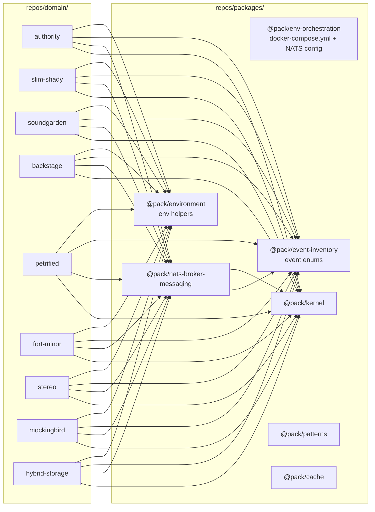

## Constraints

- **NEVER modify `@pack/kernel`** -- use its abstractions, don't change them
- **No shared infra between micros** -- each micro owns its own Mongo/Redis/MinIO
- **NATS stays shared** -- single event plane for the entire platform
- **Don't break `pnpm infra`** -- docker scripts must work end-to-end after refactoring
- **Follow GENERAL_CODE_GUIDELINE.md and BACKEND_CODE_GUIDELINE.md** throughout
- **Domain service migration is a separate task** -- this plan covers package/infra/orchestration only
- **Each phase must leave the workspace in a buildable state** -- no intermediate breakage

# V1 Workspace Refactoring Plan

> **Goal**: Eliminate the `repos/environment/` workspace entirely, migrate its packages to `repos/packages/`, internalize all shared infrastructure modules into each microservice, overhaul `docker-compose.yml` to give every micro its own infra instances, remove the dead `shinod-ai` monolith, and fully document the new topology.

---

## Table of Contents

- [Current State](#current-state)
- [Target State](#target-state)
- [Phase 1 -- Create New Packages](#phase-1----create-new-packages)
- [Phase 2 -- Internalize Infrastructure Per Microservice](#phase-2----internalize-infrastructure-per-microservice)
- [Phase 3 -- Update All Imports](#phase-3----update-all-imports)
- [Phase 4 -- Docker Compose Overhaul](#phase-4----docker-compose-overhaul)
- [Phase 5 -- Dockerfile and .env Updates](#phase-5----dockerfile-and-env-updates)
- [Phase 6 -- Cleanup](#phase-6----cleanup)
- [Phase 7 -- Documentation](#phase-7----documentation)
- [Phase 8 -- Smoke Tests](#phase-8----smoke-tests)
- [Execution Order](#execution-order)
- [Constraints](#constraints)

---

## Current State

### Workspace: `repos/environment/`

The `repos/environment/` workspace holds three packages:

| Package | Name | Description | Consumers |
|---------|------|-------------|-----------|
| `repos/environment/core/` | `@env/core` | Shared NestJS infra modules (NatsModule, MongodbModule, RedisModule, MinioModule, AudioStoragePort) | petrified, fort-minor, stereo |
| `repos/environment/lib/` | `@env/lib` | Env helpers (requireStringEnv, requireNumberEnv, optionalStringEnv, optionalNumberEnv) | All 9 micros (~24 import sites) |
| `repos/environment/events/event-inventory/` | `@env/event-inventory` | Event-name enums (AuthorityEvent, UserEvent, TrackEvent) | All 9 micros + `@pack/nats-broker-messaging` (~35 import sites) |

### Current `@env/core` Source Files

```
repos/environment/core/src/
├── index.ts                           # Barrel: NatsModule, RedisModule, REDIS_CLIENT, MinioModule, AudioStoragePort, MongodbModule
├── mongodb/
│   ├── mongodb.module.ts              # MongooseModule.forRoot(mongoUri(), { dbName: mongoDbName() })
│   └── mongodb.provider.ts            # mongoUri() and mongoDbName() from requireStringEnv
├── minio/
│   ├── audio-storage.port.ts          # AudioStoragePort abstract class + DownloadedAudio interface
│   ├── minio-audio-storage.adapter.ts # MinioAudioStorageAdapter using S3Client
│   ├── minio.module.ts               # Module providing AudioStoragePort
│   └── minio.provider.ts             # Provider binding AudioStoragePort -> MinioAudioStorageAdapter
├── nats/
│   └── nats.module.ts                # Module wrapping @pack/nats-broker-messaging providers
└── redis/
    ├── redis.module.ts               # Module providing REDIS_CLIENT
    └── redis.provider.ts             # REDIS_CLIENT = new Redis(requireStringEnv('REDIS_URL'))
```

### Current `@env/lib` Source Files

```
repos/environment/lib/src/
├── index.ts                           # Barrel
├── require-string-env.compute.ts      # requireStringEnv(name): string -- throws if missing
├── require-number-env.compute.ts      # requireNumberEnv(name): number -- parses, throws if NaN
├── optional-string-env.compute.ts     # optionalStringEnv(name, defaultValue): string
└── optional-number-env.compute.ts     # optionalNumberEnv(name, defaultValue): number
```

### Current `@env/event-inventory` Source Files

```
repos/environment/events/event-inventory/src/
├── index.ts                           # Barrel: AuthorityEvent, UserEvent, TrackEvent
├── event.map.ts                       # Empty placeholder
└── domain/
    ├── authority.events.enum.ts       # AuthorityEvent (UserSignedUp, UserLoggedIn, TokenRefreshed, UserLoggedOut)
    ├── user.events.enum.ts            # UserEvent (ProfileCreated, ProfileUpdated, ProfileDeleted)
    └── track.events.enum.ts           # TrackEvent (25 members: upload, petrified, fort-minor, stereo, transcoding, HLS)
```

### Current `docker-compose.yml` Problems

Located at `repos/environment/docker-compose.yml`:

1. Still references dead `shinod-ai` monolith service (directory `repos/domain/ai/shinod-ai/` does not exist)
2. Uses **shared** infrastructure:
   - `mongo` shared by authority, slim-shady, backstage
   - `mongo-shinod-ai` shared by the old AI monolith
   - `redis-shinoda` shared by the old AI monolith
   - `minio` shared by soundgarden, mockingbird, hybrid-storage, and AI services
3. Shared volumes (`uploads`, `hls_staging`) create implicit coupling between services
4. Missing individual service entries for petrified, fort-minor, stereo
5. Missing slim-shady and hybrid-storage from `APP_SERVICES` in docker scripts

### Current Docker Script Issues (`bin/docker/*.sh`)

All three scripts reference `$ROOT_DIR/repos/environment/docker/docker-compose.yml` (stale path -- the file was moved to `repos/environment/docker-compose.yml`).

`docker-up.sh`:
- `APP_SERVICES` is missing: `slim-shady`, `hybrid-storage`, `petrified`, `fort-minor`, `stereo`
- `APP_ENV_FILES` references `repos/domain/ai/shinod-ai/.env` which does not exist

`docker-down.sh` / `docker-ps.sh`:
- `APP_SERVICES` is missing the same services as above

### Current Microservice Inventory

| Micro | Location | Port | Dockerfile | Has .env.template | Imports @env/core | Imports @env/lib | Imports @env/event-inventory |
|-------|----------|------|------------|-------------------|-------------------|------------------|------------------------------|
| authority | `repos/domain/identity/authority/` | 7000 | Yes | Yes | No | Yes (8 files) | Yes (8 files) |
| slim-shady | `repos/domain/identity/slim-shady/` | 7400 | Yes | Yes | No | Yes (2 files) | Yes (7 files) |
| soundgarden | `repos/domain/streaming/soundgarden/` | 7100 | Yes | Yes | No | Yes (3 files) | Yes (2 files) |
| backstage | `repos/domain/realtime/backstage/` | 4001 | Yes | Yes | No | Yes (2 files) | Yes (3 files) |
| petrified | `repos/domain/ai/petrified/` | 7201 | Yes | Yes | Yes (5 files) | Yes (2 files) | Yes (3 files) |
| fort-minor | `repos/domain/ai/fort-minor/` | 7202 | Yes | Yes | Yes (4 files) | Yes (3 files) | Yes (2 files) |
| stereo | `repos/domain/ai/stereo/` | 7203 | Yes | Yes | Yes (2 files) | Yes (4 files) | Yes (3 files) |
| mockingbird | `repos/domain/streaming/mockingbird/` | 7200 | Yes | Yes | No | Yes (2 files) | Yes (3 files) |
| hybrid-storage | `repos/domain/streaming/hybrid-storage/` | 7300 | Yes | Yes | No | No | Yes (3 files) |

---

## Target State

### New Package Topology



### Core Principles

- **NO SHARABLE INFRA COMPONENTS** -- every micro owns its MongoDB, Redis, MinIO modules and adapters locally
- **NATS stays shared** -- single event plane for the entire platform
- **Shared code is abstractions only** -- `@pack/kernel` (DDD primitives), `@pack/nats-broker-messaging` (transport), `@pack/event-inventory` (event names), `@pack/environment` (env utilities), `@pack/patterns` (resilience)
- **NEVER modify `@pack/kernel`** -- use its abstractions, don't change them
- **Each micro is independently deployable** -- own Dockerfile, own `.env`, own infra in `docker-compose.yml`

### Target Directory Structure After Refactoring

```
repos/
├── packages/
│   ├── kernel/                        # @pack/kernel (UNCHANGED)
│   ├── nats-broker-messaging/         # @pack/nats-broker-messaging (dep update only)
│   ├── patterns/                      # @pack/patterns (UNCHANGED)
│   ├── cache/                         # @pack/cache (UNCHANGED)
│   ├── neon-tokens/                   # @pack/neon-tokens (UNCHANGED)
│   ├── environment/                   # @pack/environment (NEW -- from @env/lib)
│   ├── event-inventory/               # @pack/event-inventory (NEW -- from @env/event-inventory)
│   └── env-orchestration/     # @pack/env-orchestration (NEW -- docker-compose.yml)
├── domain/
│   ├── identity/
│   │   ├── authority/                 # @micro/authority (local MongoDB + NATS infra)
│   │   └── slim-shady/               # @micro/slim-shady (local MongoDB + NATS infra)
│   ├── streaming/
│   │   ├── soundgarden/              # @micro/soundgarden (local MinIO + NATS infra)
│   │   ├── mockingbird/              # @micro/mockingbird (local MinIO + NATS infra)
│   │   └── hybrid-storage/           # @micro/hybrid-storage (local MinIO + NATS infra)
│   ├── ai/
│   │   ├── petrified/                # @micro/petrified (local Redis + MinIO + NATS infra)
│   │   ├── fort-minor/               # @micro/fort-minor (local Redis + MinIO + NATS infra)
│   │   └── stereo/                   # @micro/stereo (local MongoDB + NATS infra)
│   └── realtime/
│       └── backstage/                # @micro/backstage (local MongoDB + NATS infra)
├── apps/
│   └── pulse/                        # Next.js frontend/BFF (UNCHANGED)
└── agents/
    └── shinoda/                      # Agent (UNCHANGED)
```

### Target Docker Compose Topology

```mermaid
flowchart TD
  subgraph shared ["Shared Infrastructure"]
    nats["nats\n:4222 / :8222"]
  end

  subgraph identity ["Identity Infra"]
    authMongo["authority-mongo\n:27017"]
    slimMongo["slim-shady-mongo\n:27018"]
  end

  subgraph streaming ["Streaming Infra"]
    soundMinio["soundgarden-minio\n:9010"]
    mockMinio["mockingbird-minio\n:9020"]
    hybMinio["hybrid-storage-minio\n:9030"]
  end

  subgraph ai ["AI Infra"]
    petRedis["petrified-redis\n:6380"]
    petMinio["petrified-minio\n:9040"]
    fortRedis["fort-minor-redis\n:6381"]
    fortMinio["fort-minor-minio\n:9050"]
    sterMongo["stereo-mongo\n:27019"]
  end

  subgraph realtime ["Realtime Infra"]
    backMongo["backstage-mongo\n:27020"]
  end

  auth["authority :7000"] --> authMongo & nats
  slim["slim-shady :7400"] --> slimMongo & nats
  sound["soundgarden :7100"] --> soundMinio & nats
  back["backstage :4001"] --> backMongo & nats
  pet["petrified :7201"] --> petRedis & petMinio & nats
  fort["fort-minor :7202"] --> fortRedis & fortMinio & nats
  ster["stereo :7203"] --> sterMongo & nats
  mock["mockingbird :7200"] --> mockMinio & nats
  hyb["hybrid-storage :7300"] --> hybMinio & nats
  pulse["pulse :3000"] --> auth
  shinoda["shinoda :4111"] --> back
```



---

## Phase 1 -- Create New Packages

### 1.1 `@pack/environment` (absorbs `@env/lib`)

**Location**: `repos/packages/environment/`

Move the four env-helper files and barrel from `repos/environment/lib/src/` into `repos/packages/environment/src/`. No runtime dependencies -- pure `process.env` utilities.

**`repos/packages/environment/package.json`**:
```json
{
  "name": "@pack/environment",
  "version": "0.1.0",
  "private": true,
  "main": "dist/index.js",
  "types": "dist/index.d.ts",
  "files": ["dist", "src"],
  "exports": {
    ".": {
      "types": "./dist/index.d.ts",
      "default": "./dist/index.js"
    }
  },
  "scripts": {
    "build": "tsc -p tsconfig.build.json"
  },
  "devDependencies": {
    "typescript": "^5",
    "@types/node": "^20"
  }
}
```

**`repos/packages/environment/tsconfig.json`**:
```json
{
  "compilerOptions": {
    "outDir": "dist",
    "rootDir": "src",
    "declaration": true,
    "module": "CommonJS",
    "target": "ES2022",
    "strict": true,
    "esModuleInterop": true
  },
  "include": ["src"]
}
```

**`repos/packages/environment/tsconfig.build.json`**:
```json
{
  "extends": "./tsconfig.json",
  "exclude": ["node_modules", "dist", "test", "**/*.spec.ts"]
}
```

**Target file structure**:
```
repos/packages/environment/
├── package.json
├── tsconfig.json
├── tsconfig.build.json
├── README.md
└── src/
    ├── index.ts
    ├── require-string-env.compute.ts
    ├── require-number-env.compute.ts
    ├── optional-string-env.compute.ts
    └── optional-number-env.compute.ts
```

**`src/index.ts`**:
```typescript
export { requireStringEnv } from './require-string-env.compute'
export { requireNumberEnv } from './require-number-env.compute'
export { optionalStringEnv } from './optional-string-env.compute'
export { optionalNumberEnv } from './optional-number-env.compute'
```

**`src/require-string-env.compute.ts`** (add JSDoc):
```typescript
/**
 * Reads a required string environment variable.
 * Throws immediately at startup if the variable is missing or empty,
 * enforcing the fail-fast convention from GENERAL_CODE_GUIDELINE.
 */
export function requireStringEnv(name: string): string {
  const value = process.env[name]
  if (!value) {
    throw new Error(`Missing required environment variable: ${name}`)
  }
  return value
}
```

**`src/require-number-env.compute.ts`** (add JSDoc):
```typescript
import { requireStringEnv } from './require-string-env.compute'

/**
 * Reads a required numeric environment variable.
 * Delegates to requireStringEnv for presence check, then validates
 * the value parses to a finite number.
 */
export function requireNumberEnv(name: string): number {
  const value = requireStringEnv(name)
  const parsed = Number(value)
  if (!Number.isFinite(parsed)) {
    throw new Error(`Environment variable ${name} must be a valid number`)
  }
  return parsed
}
```

**`src/optional-string-env.compute.ts`** (add JSDoc):
```typescript
/**
 * Reads an optional string environment variable, returning a default
 * when the variable is not set.
 */
export function optionalStringEnv(name: string, defaultValue: string): string {
  return process.env[name] ?? defaultValue
}
```

**`src/optional-number-env.compute.ts`** (add JSDoc):
```typescript
/**
 * Reads an optional numeric environment variable, returning a default
 * when the variable is not set. Throws if the value is present but
 * not a valid finite number.
 */
export function optionalNumberEnv(name: string, defaultValue: number): number {
  const value = process.env[name]
  if (!value) return defaultValue
  const parsed = Number(value)
  if (!Number.isFinite(parsed)) {
    throw new Error(`Environment variable ${name} must be a valid number`)
  }
  return parsed
}
```

---

### 1.2 `@pack/event-inventory` (absorbs `@env/event-inventory`)

**Location**: `repos/packages/event-inventory/`

Move everything from `repos/environment/events/event-inventory/` into the new location. Rename the package from `@env/event-inventory` to `@pack/event-inventory`. Add JSDoc comments to each enum and its members.

**`repos/packages/event-inventory/package.json`**:
```json
{
  "name": "@pack/event-inventory",
  "version": "0.1.0",
  "private": true,
  "main": "dist/index.js",
  "types": "dist/index.d.ts",
  "files": ["dist", "src"],
  "exports": {
    ".": {
      "types": "./dist/index.d.ts",
      "default": "./dist/index.js"
    }
  },
  "scripts": {
    "build": "tsc -p tsconfig.build.json"
  },
  "devDependencies": {
    "typescript": "^5"
  }
}
```

**`repos/packages/event-inventory/tsconfig.json`**:
```json
{
  "compilerOptions": {
    "outDir": "dist",
    "rootDir": "src",
    "declaration": true,
    "module": "CommonJS",
    "target": "ES2022",
    "strict": true,
    "esModuleInterop": true
  },
  "include": ["src"]
}
```

**`repos/packages/event-inventory/tsconfig.build.json`**:
```json
{
  "extends": "./tsconfig.json",
  "exclude": ["node_modules", "dist", "test", "**/*.spec.ts"]
}
```

**Target file structure**:
```
repos/packages/event-inventory/
├── package.json
├── tsconfig.json
├── tsconfig.build.json
├── README.md
└── src/
    ├── index.ts
    ├── event.map.ts
    └── domain/
        ├── authority.events.enum.ts
        ├── user.events.enum.ts
        └── track.events.enum.ts
```

**`src/index.ts`**:
```typescript
export { AuthorityEvent } from './domain/authority.events.enum'
export { UserEvent } from './domain/user.events.enum'
export { TrackEvent } from './domain/track.events.enum'
```

**`src/domain/authority.events.enum.ts`** (add JSDoc):
```typescript
/**
 * NATS subjects emitted by the Authority microservice.
 * These cover the full authentication lifecycle: signup, login,
 * token refresh, and logout.
 */
export enum AuthorityEvent {
  /** Emitted when a new user completes signup (consumed by Slim Shady). */
  UserSignedUp = 'authority.user.signed_up',
  /** Emitted when an existing user logs in (observability only). */
  UserLoggedIn = 'authority.user.logged_in',
  /** Emitted when a JWT access token is refreshed (observability only). */
  TokenRefreshed = 'authority.token.refreshed',
  /** Emitted when a user logs out and the session is destroyed (observability only). */
  UserLoggedOut = 'authority.user.logged_out'
}
```

**`src/domain/user.events.enum.ts`** (add JSDoc):
```typescript
/**
 * NATS subjects emitted by the Slim Shady (user profile) microservice.
 * These cover the user profile lifecycle.
 */
export enum UserEvent {
  /** Emitted after a user profile is created (consumed by Authority for profileId backfill). */
  ProfileCreated = 'user.profile.created',
  /** Emitted when a user profile is updated. */
  ProfileUpdated = 'user.profile.updated',
  /** Emitted when a user profile is deleted (modeled but not currently produced). */
  ProfileDeleted = 'user.profile.deleted'
}
```

**`src/domain/track.events.enum.ts`** (add JSDoc):
```typescript
/**
 * NATS subjects for the track processing pipeline.
 * Covers the full lifecycle: upload, fingerprinting (Petrified),
 * transcription (Fort Minor), reasoning (Stereo), transcoding
 * (Mockingbird), and HLS persistence (Hybrid Storage).
 */
export enum TrackEvent {
  /** Upload received by Soundgarden (Backstage observes). */
  UploadReceived = 'track.upload.received',
  /** Upload validated by Soundgarden (Backstage observes). */
  UploadValidated = 'track.upload.validated',
  /** Upload stored to object storage by Soundgarden (Backstage observes). */
  UploadStored = 'track.upload.stored',
  /** Upload fully completed -- triggers Petrified fingerprinting (consumed by Petrified, Backstage). */
  Uploaded = 'track.uploaded',
  /** Upload failed (Backstage observes). */
  UploadFailed = 'track.upload.failed',

  /** Fingerprint generated by Petrified (consumed by Fort Minor, Stereo, Backstage). */
  PetrifiedGenerated = 'track.petrified.generated',
  /** Song identified by Petrified (Backstage observes). */
  PetrifiedSongFound = 'track.petrified.song.found',
  /** Song not found in fingerprint DB (Backstage observes). */
  PetrifiedSongUnknown = 'track.petrified.song.unknown',
  /** Fingerprint detected/matched (Backstage observes). */
  PetrifiedDetected = 'track.petrified.detected',
  /** Fingerprinting failed (Backstage observes). */
  PetrifiedFailed = 'track.petrified.failed',
  /** Duplicate track detected by Petrified (Backstage observes). */
  DuplicateDetected = 'track.duplicate.detected',

  /** Transcription started by Fort Minor (Backstage observes). */
  FortMinorStarted = 'track.fort-minor.started',
  /** Transcription completed by Fort Minor (consumed by Stereo, Backstage). */
  FortMinorCompleted = 'track.fort-minor.completed',
  /** Transcription failed (Backstage observes). */
  FortMinorFailed = 'track.fort-minor.failed',

  /** AI reasoning started by Stereo (Backstage observes). */
  StereoStarted = 'track.stereo.started',
  /** Track approved by Stereo (consumed by Mockingbird, Backstage). */
  Approved = 'track.approved',
  /** Track rejected by Stereo (Backstage observes). */
  Rejected = 'track.rejected',
  /** AI reasoning failed (Backstage observes). */
  StereoFailed = 'track.stereo.failed',

  /** Transcoding started by Mockingbird (Backstage observes). */
  TranscodingStarted = 'track.transcoding.started',
  /** Transcoding completed by Mockingbird (Backstage observes). */
  TranscodingCompleted = 'track.transcoding.completed',
  /** Transcoding failed (Backstage observes). */
  TranscodingFailed = 'track.transcoding.failed',

  /** HLS package generated by Mockingbird (consumed by Hybrid Storage, Backstage). */
  HlsGenerated = 'track.hls.generated',
  /** HLS package persisted by Hybrid Storage (Backstage observes). */
  HlsStored = 'track.hls.stored',
  /** HLS generation/persistence failed (Backstage observes). */
  HlsFailed = 'track.hls.failed'
}
```

---

### 1.3 `@pack/env-orchestration` (absorbs `@env/core` orchestration role)

**Location**: `repos/packages/env-orchestration/`

This is a **non-TypeScript** workspace package. It holds Docker orchestration files only. The NestJS modules that lived in `@env/core` (MongodbModule, RedisModule, MinioModule, NatsModule) are **not** carried over -- they are replaced by per-micro local infra modules (Phase 2).

**Target file structure**:
```
repos/packages/env-orchestration/
├── package.json
├── .env.template
├── docker-compose.yml
└── README.md
```

**`repos/packages/env-orchestration/package.json`**:
```json
{
  "name": "@pack/env-orchestration",
  "version": "0.1.0",
  "private": true
}
```

**`repos/packages/env-orchestration/.env.template`**:
```env
# Orchestration-level env vars used by docker-compose.yml
# Each micro has its own .env file for service-specific configuration.
MINIO_ROOT_USER=minioadmin
MINIO_ROOT_PASSWORD=minioadmin
```

The `docker-compose.yml` content is detailed in [Phase 4](#phase-4----docker-compose-overhaul).

