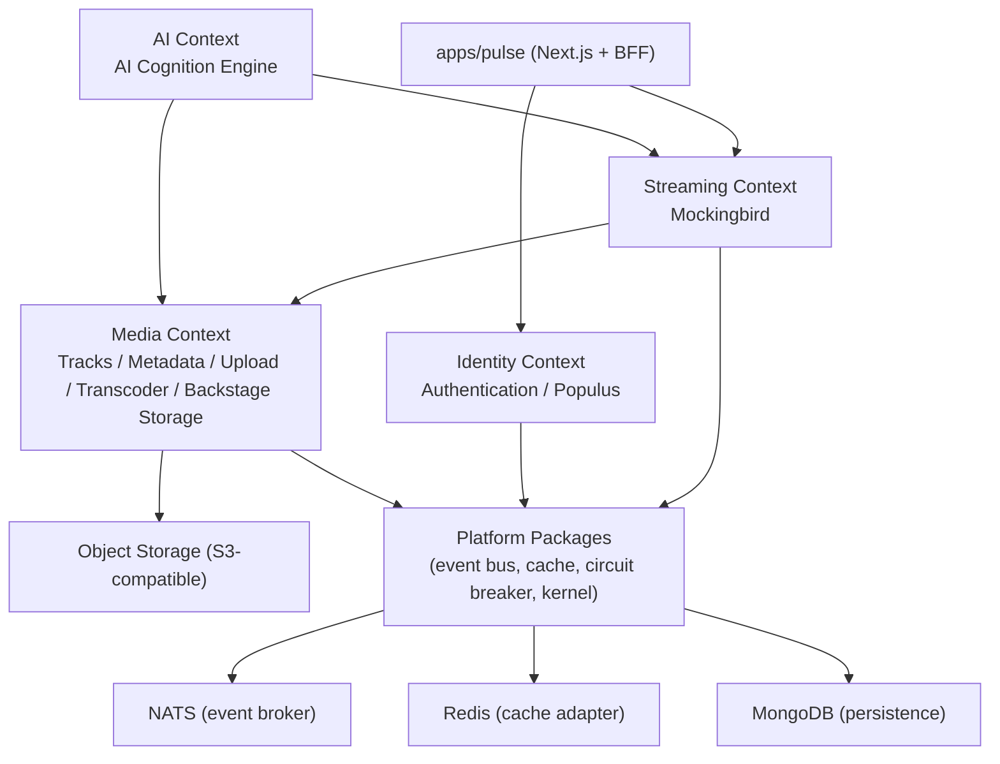
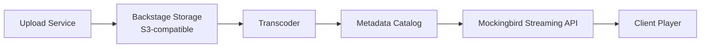
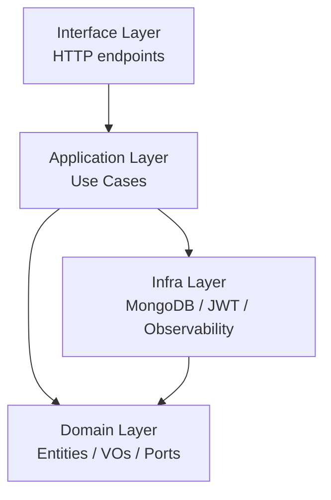
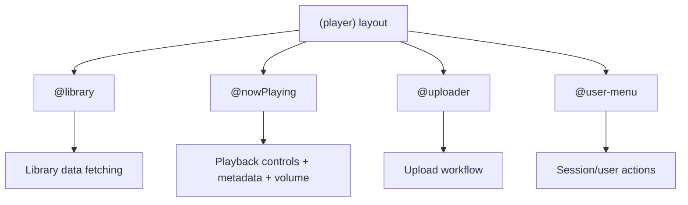
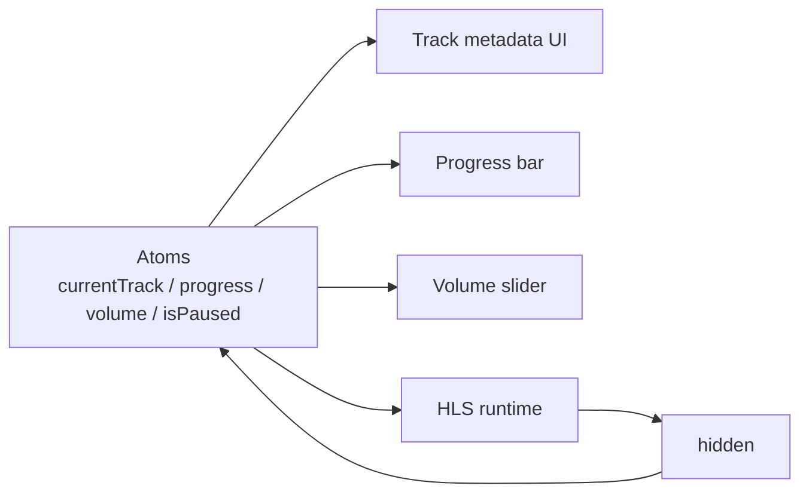
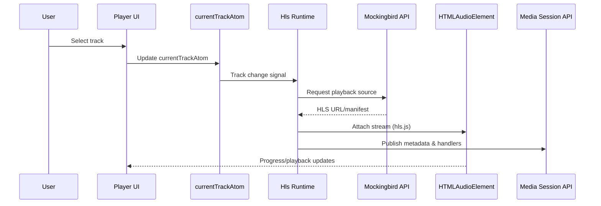
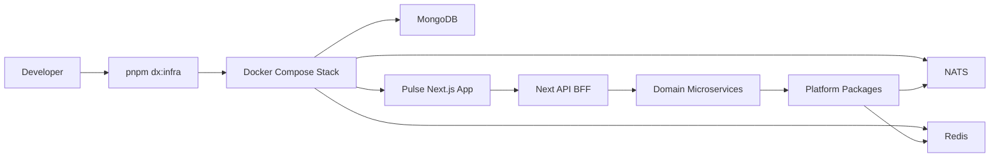

# Pulse 

>The app that hates your > 2000s songs. 😤

A distributed music streaming platform monorepo designed to explore production-grade architecture for Spotify-like experiences. You won't be able to upload > 2000 songs, Nivana :white_check_mark:, Justin Bieber (Sorry!). No bias at all, I actually like it, but I needed one feature.

If you try to hack it, you'll fail by our transcoder and Vercel's [@ai-sdk/openai](https://ai-sdk.dev/docs/ai-sdk-core/transcription) AI reasoning. All [Linkin Park](https://linkinpark.com/) songs are allowed though. Somebody put an `IF` in the code base, damn! :eyes: 

<p align="center">
  
</p>

 This repository combines a Next.js frontend, domain microservices, and internal platform packages to deliver resilient streaming, modular domain design, and a fast developer workflow.

---

## README Glossary 📚

- Root
  - [Monorepo Overview](README.md)
- Applications (`apps/`)
  - [Pulse Frontend Guide](apps/pulse/README.md)
  - [Pulse API Layer (BFF)](apps/pulse/app/api/README.md)
  - [Pulse HLS Streaming Runtime](apps/pulse/app/lib/hls/README.md)
- Bounded Contexts (`domain/`)
  - [Domain Architecture Overview](domain/README.md)
  - Identity
    - [Authentication Service](domain/identity/README.md)
    - [Populus Identity Directory](domain/identity/populus/README.md)
  - Media
    - [Media Bounded Context](domain/media/README.md)
    - [Upload Service](domain/media/upload/README.md)
    - [Backstage Storage Service](domain/media/backstage-storage/README.md)
    - [Transcoder Service](domain/media/transcoder/README.md)
    - [Tracks Service](domain/media/tracks/README.md)
    - [Metadata Service](domain/media/metadata/README.md)
  - Streaming
    - [Streaming Bounded Context](domain/streaming/README.md)
    - [Mockingbird Streaming Service](domain/streaming/mocking-bird/README.md)
  - AI
    - [AI Bounded Context](domain/ai/README.md)
    - [AI Cognition Engine](domain/ai/ai-cognition-engine/README.md)
- Platform Packages (`packages/`)
  - [Platform Packages Overview](packages/README.md)
  - [Neon Theme Tokens](packages/neon/README.md)
- Tooling (`bin/`)
  - [Developer Tooling and DX Scripts](bin/README.md)

## Vision And Architectural Direction 🧭

Pulse is intentionally built around architectural separation and explicit boundaries:

- **Domain-Driven Design (DDD):** business capabilities are isolated in bounded contexts.
- **Clean Architecture layers:** services follow layered structure (`interface`, `application`, `domain`, `infra`) where applicable.
- **Ports and Adapters:** domain abstractions live in ports; infrastructure implementations are provided as adapters.
- **Event-Driven Architecture:** domain collaboration uses asynchronous messaging patterns with NATS.
- **Resilience by default:** shared circuit breaker and cache abstractions reduce failure blast radius.
- **Streaming-first UI design:** frontend is optimized for segmented media playback and independent UI updates.

This architecture aims to keep business logic independent from framework and infrastructure concerns, so services can evolve without becoming tightly coupled to Redis, NATS, MongoDB, or UI delivery choices.

## Monorepo Structure 🏗️

The repository is organized into three main workspace groups plus operational tooling:

| Area | Purpose |
|---|---|
| `apps/` | Client-facing applications (currently `apps/pulse`, a Next.js Spotify-like interface + BFF routes). |
| `packages/` | Internal platform building blocks (kernel primitives, event bus, cache, Redis/NATS adapters, circuit breaker, design tokens). |
| `domain/` | Bounded contexts and microservices (`domain/<context>/<service>`), modeling core business capabilities. |
| `bin/` | DX and operations scripts (Docker orchestration, smoke tests, commit hooks, env/bootstrap automation). |

### Workspace Patterns (pnpm)

- `apps/*`
- `packages/*`
- `domain/*/*`

## High-Level Architecture 🌐



## Core Architectural Patterns 🧠

### 1) Domain-Driven Design + Bounded Contexts

The domain is divided into contexts with clear ownership:

- **Identity:** authentication and identity directory concerns.
- **Media:** asset ingestion, processing, metadata, and track lifecycle.
- **Streaming:** playback delivery APIs and stream resolution.
- **AI:** intelligent processing and recommendation-oriented capabilities.

Each context evolves independently, reducing cross-domain coupling and preserving ubiquitous language per domain.

### 2) Clean Architecture Layering

The repository applies layered design across services (explicitly documented in `identity/authentication`):

- `interface`: HTTP/controllers/routes and transport entry points.
- `application`: use cases and orchestration logic.
- `domain`: entities, value objects, domain rules, domain ports.
- `infra`: persistence/providers/adapters (MongoDB, JWT, observability, etc.).

This keeps business rules testable and framework-independent.

### 3) Ports And Adapters (Hexagonal)

The platform layer provides explicit abstractions and concrete infrastructure adapters:

| Port/Abstraction | Adapter/Implementation |
|---|---|
| `packages/event-bus` | `packages/event-bus-nats` |
| `packages/cache` | `packages/cache-redis` |
| Domain ports (e.g. auth ports) | Infra persistence/providers in service `infra/` folders |

Result: swapping infrastructure backends is localized to adapters, not domain logic.

### 4) Event-Driven Integration (NATS)

Asynchronous collaboration is a first-class model for microservice communication. NATS is used through the event bus adapter package, enabling domain event publication/subscription without binding services directly to broker APIs.

### 5) Resilience Patterns

- **Circuit Breaker:** shared package standardizes failure-state handling (`Closed`, `Open`, `HalfOpen`) to prevent cascading failures.
- **Caching Strategy:** cache abstraction + Redis adapter support low-latency reads and cache-aside service patterns in bounded contexts.

## Domain Layer (`domain/`) 🏛️

### Context Overview

| Context | Services | Primary Role |
|---|---|---|
| `identity` | `authentication`, `populus` | Auth, token lifecycle, canonical identity profiles. |
| `media` | `upload`, `backstage-storage`, `transcoder`, `tracks`, `metadata` | Full media lifecycle from ingestion to catalog data. |
| `streaming` | `mocking-bird` | Playback APIs and stream/session resolution. |
| `ai` | `ai-cognition-engine` | Intelligence features (recommendation, enrichment, analysis). |

### Media Processing Pipeline



### Identity Context Layering Example



## Apps Layer (`apps/`) 🎛️

## `apps/pulse` (Next.js Frontend + BFF)

Pulse frontend is built for highly interactive streaming UX, with independent interface pieces that update at different cadences.

### Frontend Technical Direction

| Topic | Approach | Why |
|---|---|---|
| Routing | Next.js App Router + Parallel Routes + Slots | Decouples major UI regions and allows independent rendering/loading behavior. |
| State | Jotai + Jotai Immer | Fine-grained atom subscriptions minimize rerenders and simplify localized updates. |
| Streaming | `hls.js` runtime layer | Segmented progressive streaming with playback resilience. |
| System controls | Media Session API | Native OS/browser playback integration (lock screen, media keys, headset controls). |
| UI primitives | `shadcn/ui` + Tailwind + `@repo/neon` tokens | Fast component composition with project-specific visual identity. |
| Validation | Zod | Runtime contracts for API boundaries and safer request handling. |

### Co-location + Naming Conventions

Frontend modules are organized with co-location and explicit suffixes (for example `*.domain.ts`, `*.types.ts`, `*.guard.ts`, `*.service.ts`, `*.hook.ts`) to keep related logic physically close while preserving role clarity.

### Parallel Routes and Slot Composition



This pattern behaves like a micro-frontend-style composition model without splitting into independent frontend deployments. It is especially useful when slot latencies differ and cached regions can resolve faster than live regions.

### Fine-Grained Player State With Jotai + Immer



The player state model allows tiny state slices to control tiny UI fragments, improving responsiveness and reducing unnecessary rendering work in a Spotify-like always-on playback interface.

### HLS + Media Session Runtime Flow



### BFF API Layer (`apps/pulse/app/api`)

The Next.js API folder acts as a thin Backend-for-Frontend orchestration layer:

- validates requests
- verifies auth/session constraints
- delegates to domain microservices
- maps domain/transport errors into stable UI-friendly HTTP responses

It intentionally avoids domain business logic and keeps transport concerns centralized.

## Packages Layer (`packages/`) 📦

The platform package set provides reusable runtime capabilities across services.

| Package | Role |
|---|---|
| `kernel` | Core DDD/platform primitives (`Entity`, `AggregateRoot`, `ValueObject`, `DomainEvent`, result/either utilities). |
| `event-bus` | Messaging abstraction for publishing/subscribing domain events. |
| `event-bus-nats` | NATS adapter implementing event bus contracts. |
| `cache` | Cache abstraction/port for services. |
| `cache-redis` | Redis adapter implementing cache contracts. |
| `circuit-breaker` | Shared resilience primitive for failure isolation and recovery probing. |
| `neon` | Shared color tokens for brand/UI consistency (used to extend shadcn/Tailwind styling in apps). |

This package layer is the internal platform foundation that keeps services lightweight and infrastructure-agnostic.

## Tooling And Platform Wellness ⚙️

The repository includes a strong developer-experience and governance setup in `bin/`.

### Operational Scripts

| Command | Purpose |
|---|---|
| `pnpm docker:up` | Start infrastructure/apps via Docker scripts. |
| `pnpm docker:down` | Stop and remove containers. |
| `pnpm docker:ps` | Inspect active services. |
| `pnpm dx:infra` | Recreate local infra stack (`down` -> `up` -> `ps`). |
| `pnpm dx:env:template` | Generate `.env` files from `.env.template`. |
| `pnpm dx:smoke` | Run smoke checks for critical services. |
| `pnpm dx:cleanup` | Clear local build/dependency artifacts. |
| `pnpm dx:reset` | Cleanup + reinstall + rebuild monorepo. |

### Commit And Quality Gates

- **Husky hooks** for `pre-commit`, `commit-msg`, and post-pull workflows.
- **Commitlint** enforcing Conventional Commits (`type(scope): description`).
- **lint-staged + Biome** to lint/format staged files before commit.
- **Turborepo** for task orchestration, dependency-aware build order, and caching.

These constraints intentionally block non-standard commit messages and reduce drift in code quality/style.

## End-To-End Platform Flow 🔄



## Quick Start 🚀

```bash
pnpm install
pnpm dx:env:template
pnpm dx:infra
pnpm dev
```

Then open:

- `http://localhost:3000`

## Why This Architecture For A Streaming Product ✅

This setup is a practical fit for Spotify-like applications because it combines:

- independent UI slots with independent data/update lifecycles,
- streaming-optimized runtime behavior (HLS + system media controls),
- state granularity for highly interactive player controls,
- domain and infrastructure decoupling through DDD + ports/adapters,
- platform-level resilience and messaging patterns for microservice evolution.

It enables fast product iteration today while keeping boundaries strong enough for long-term scale.
