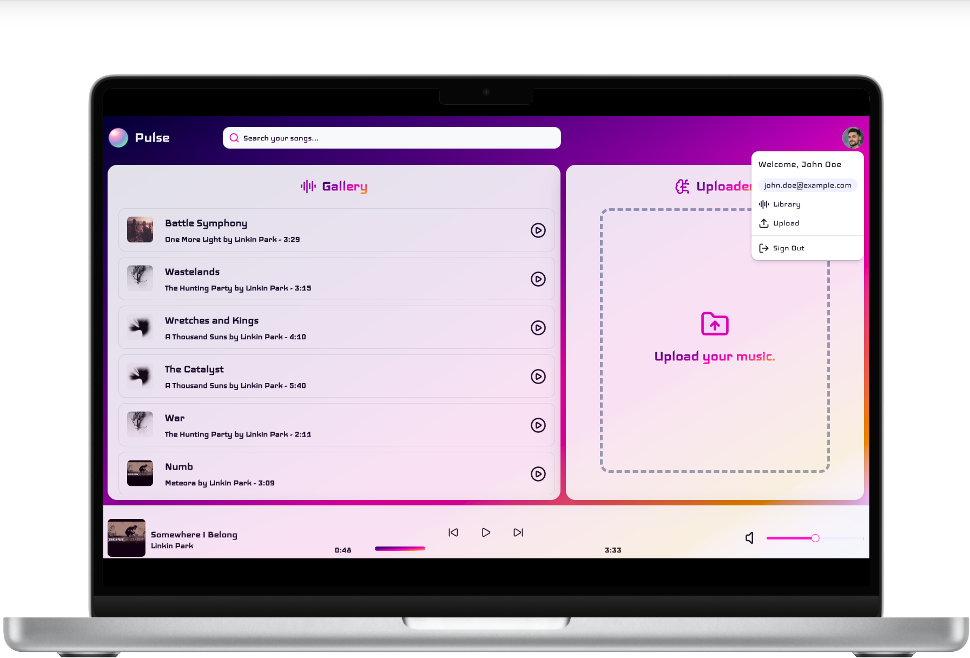
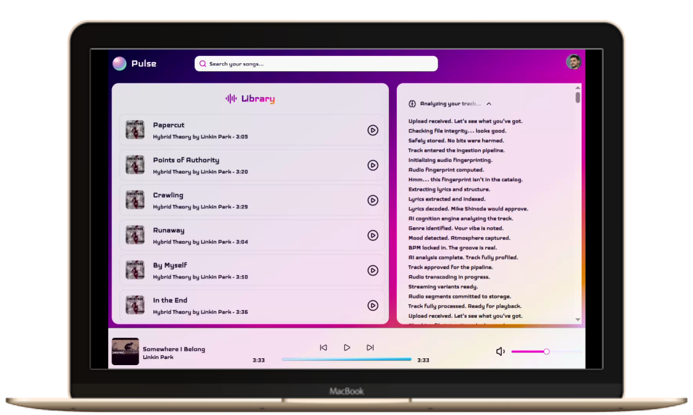
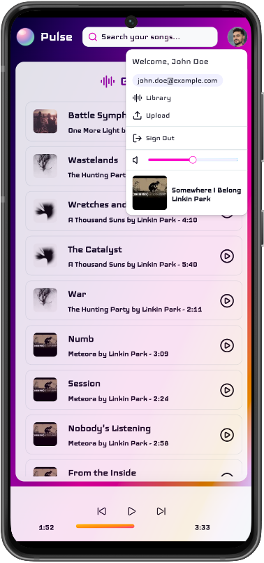

# Pulse 

>The app that hates your post-2000 songs. 😤

A distributed music streaming platform monorepo designed to explore production-grade architecture for Spotify-like experiences. The "post-2000 rejection" rule is an intentional product experiment used to exercise the event pipeline (Nirvana: yes, Justin Bieber: sorry).

If you try to hack it, you'll still run through validation, AI reasoning, and transcoding stages. All [Linkin Park](https://linkinpark.com/) songs are allowed though. Somebody put an `IF` in the code base, damn! :eyes:

<p align="center">
  
</p>

 This repository combines a Next.js frontend, domain microservices, and internal platform packages to deliver resilient streaming, modular domain design, and a fast developer workflow.

---

## Monorepo Structure 🗂️

Pulse is a **pnpm workspace** monorepo coordinated by **Turborepo**. The workspace topology isn't incidental tooling — it is the architecture. pnpm enforces explicit dependency boundaries between packages and services. Turbo makes shared packages first-class build inputs, so every service compiles against the same DDD vocabulary without version drift.

```
pulse/
└── repos/                       # 🗂️  All workspaces live under this folder
    ├── apps/                    # 🖥️  User-facing applications
    │   └── pulse/               #     Next.js 16 player UI + BFF
    │
    ├── agents/                  # 🤖  AI orchestration agents
    │   ├── shinoda/             #     Mastra-powered dev agent
    │   └── .agents/             # 📋  Agent context, skills, and plans
    │       ├── context/
    │       ├── plans/
    │       └── skills/
    │
    ├── packages/                # 📦  Shared infrastructure libraries
    │   ├── kernel/              #     DDD primitives (Entity, UseCase, EventBus…)
    │   ├── event-bus/           #     NATS adapter + queue consumer wiring
    │   ├── cache/               #     Redis cache abstraction
    │   ├── patterns/            #     Circuit breaker + resilience patterns
    │   ├── environment/         #     Typed env-var helpers
    │   └── neon/                #     Synthwave design tokens + Tailwind overrides
    │
    ├── domain/                  # 🔷  Bounded-context microservices
    │   ├── identity/
    │   │   ├── authority/       #     Auth, JWT, sessions, OAuth
    │   │   └── slim-shady/      #     User profiles + preferences
    │   ├── streaming/
    │   │   ├── soundgarden/     #     Upload ingestion edge
    │   │   ├── mockingbird/     #     MP3 transcoder
    │   │   └── hybrid-storage/  #     HLS segment store + delivery provider
    │   ├── ai/
    │   │   └── shinod-ai/       #     Fingerprinting, transcription, reasoning
    │   └── realtime/
    │       └── backstage/       #     Pipeline projection + Socket.IO broadcast
    │
    └── infrastructure/
        └── docker/
            └── docker-compose.yml  # 🐳  Full platform topology
```

### Workspace Naming Philosophy

The naming convention is intentional and layered:

| Layer | Style | Rationale |
|---|---|---|
| `apps/` | Product names | User-facing applications named after what they do |
| `agents/` | Music artists | AI personalities with character — any music reference, not a fixed theme |
| `packages/` | Functional/descriptive | Infrastructure must be self-evident |
| `domain/<context>/` | Business terminology | DDD bounded contexts in plain language |
| `domain/<context>/<service>` | Music references | Each service has a story (see [Nomenclature](#components-nomenclature-)) |

---

## Components Nomenclature 🎵

Every microservice name is a music reference. This isn't decoration — it's a signal that the service has a distinct identity and a single well-scoped responsibility.

| Service | Music Reference | Why It Fits |
|---|---|---|
| **Soundgarden** | Band name | A garden where you deposit audio — the ingestion entry point |
| **Mockingbird** | Eminem song | A bird that mimics sounds; the transcoder re-sings the original in new formats |
| **Slim Shady** | Eminem alter ego | The profile service hides behind the identity — a secondary persona |
| **Authority** | "Points of Authority" (Linkin Park) | Owns access control for the whole platform — it dictates what you're allowed to do |
| **Shinod AI** | Mike Shinoda (Linkin Park) | Orchestrates everything — just like Shinoda orchestrates LP's production |
| **Petrified** | Fort Minor song | Freezes audio identity — the fingerprinting module |
| **Fort Minor** | Mike Shinoda's side project | Extracts the voice — the transcription module |
| **Stereo** | Fort Minor song | Dual-channel thinking: merges fingerprint + transcription to decide |
| **Hybrid Storage** | *Hybrid Theory* (Linkin Park debut album) | "Hybrid" captures the dual responsibility — it both stores HLS segments to MinIO and serves them as a delivery provider for playback |
| **Backstage** | Venue metaphor | The place where the real show is observed, not performed |

> All Linkin Park songs pass the reasoning stage. Somebody put an `IF` in the codebase. 👀

---

## Architecture 🏛️

### Clean Architecture Per Service

Every microservice follows the same four-layer structure so the codebase stays navigable regardless of which service you're in:

```
<service>/
├── domain/          # Entities, Value Objects, Events, Ports (abstract classes)
├── application/     # Use Cases — extend UseCase from @pack/kernel
├── infra/           # DB adapters, NATS wiring, MinIO, Redis, config
└── interface/       # HTTP controllers, NATS consumers, guards, DTOs, pipes
```

**Ports are abstract classes, not TypeScript interfaces.** This is a deliberate convention enforced across the entire repo — it allows NestJS DI tokens to be derived from the port class itself, keeping the adapter wiring clean.

### Shared Packages

Packages are the architectural glue. They're not utilities — they're the shared vocabulary that keeps every service structurally consistent.

| Package | Exports | Used By |
|---|---|---|
| `@pack/kernel` | `UseCase`, `Entity`, `AggregateRoot`, `ValueObject`, `Event`, `EventBus`, `UniqueEntityId`, `EventMap` | All microservices |
| `@pack/event-bus` | `NatsEventBusAdapter`, queue consumer, connection provider, drain service, no-op fallback | All event-driven services |
| `@pack/cache` | `RedisLike` port, Redis adapter | Shinod AI, others |
| `@pack/patterns` | `CircuitBreaker`, `CircuitBreakerState` | Authority, sync boundaries |
| `@env/lib` | `requireStringEnv`, `requireNumberEnv`, `optionalStringEnv`, `optionalNumberEnv` | Service bootstrap |
| `@pack/neon` | Synthwave/retrowave design token scale (28 neon color tokens), Tailwind token overrides, gradient utilities (`.bg-neon`, `.text-neon`, `.bg-neon-warm`, `.bg-neon-cool`), and the `.glassy-surface` frosted-glass utility | `repos/apps/pulse` |

### Transport Model

Pulse is deliberately **not** a purely async platform. Each transport layer has a purpose:

| Transport | Used For |
|---|---|
| **HTTP** | Frontend → BFF, BFF → services, control-plane access |
| **NATS** | Async backend workflow orchestration between microservices |
| **Socket.IO** | Realtime pipeline visibility from Backstage → frontend |

---

## Frontend Architecture 🖥️

`repos/apps/pulse` is a **Next.js 16 App Router** application that acts simultaneously as the player UI and a lightweight **Backend for Frontend (BFF)**. The design reflects the platform's core rule — no post-2000 songs — through a SynthWave/Retrowave visual identity: deep purples, neon magentas, and glowing gradients that feel like a Linkin Park concert lit up in 1999.

<p align="center">
  
</p>

---

### Route Groups and Parallel Slots 🗺️

The entire routing model is built around **Next.js route groups** and **parallel slots**. Route groups establish top-level layout ownership without affecting URL structure; parallel slots let each UI region render and update independently.

```
app/
├── (public)/                    # 🔓 Unauthenticated layout root
│   └── (auth)/
│       ├── login/
│       └── signup/
│
├── (protected)/                 # 🔒 Auth-guarded layout root
│   └── (player)/                #    Player shell — the main UI
│       ├── layout.tsx           #    Owns the top-level grid, injects all slots
│       ├── @gallery/            #    ↳ Parallel slot — track gallery list
│       ├── @uploader/           #    ↳ Parallel slot — upload dropzone OR reasoning UI
│       ├── @user-menu/          #    ↳ Parallel slot — user avatar + dropdown
│       └── @now-playing/        #    ↳ Parallel slot — active playback bar
│           ├── @track-metadata/ #       ↳ Nested slot — song title + artist
│           ├── @playback/       #       ↳ Nested slot — prev / play-pause / next + scrubber
│           └── @volume-bar/     #       ↳ Nested slot — volume control
│
├── api/                         # 🔀 BFF proxy routes
│   ├── authority/               #    Login + signup forwarding
│   ├── slim-shady/profile/      #    Profile read/update proxy
│   ├── soundgarden/tracks/      #    Upload proxy
│   └── transport/hls/           #    HLS segment delivery
│
└── infra/                       # 🏗️  Frontend infrastructure (see below)
    ├── shadcn/                  #    Shadcn component registry (relocated)
    ├── immer/                   #    Immer state updater type helpers
    ├── next/                    #    Next.js PageError + layout type helpers
    └── zod/                     #    Zod schema primitives
```

Each parallel slot is a fully independent React subtree. The player layout receives `gallery`, `uploader`, `now-playing`, and `user-menu` as props and places them into the grid — no slot ever knows the others exist. This means `@gallery` can refetch its track list, `@uploader` can swap between dropzone and reasoning mode, and the playback bar keeps playing without any of them interfering with each other.

**Interface independence.** Because slots are isolated subtrees, a loading state, error boundary, or re-render in one slot is completely invisible to all others. In a Spotify-like player this matters: the gallery can show a loading spinner while the playback bar continues playing uninterrupted. The uploader can crash and recover without touching the track metadata display. There is no shared render tree that a single suspended slot can block.

**Streaming per slot.** Each parallel slot wraps its own Suspense boundary, which means Next.js can stream each region independently from the server. The page shell and the playback bar appear instantly; the gallery — which needs a data fetch — streams in behind them. The user sees a live player immediately, not a blank screen waiting for all data to resolve.

**Mobile collapse without state duplication.** The `@now-playing` slot is itself nested: it owns three inner parallel slots (`@track-metadata`, `@playback`, `@volume-bar`), each independently rendered. On mobile, `@volume-bar` and `@track-metadata` are hidden via Tailwind breakpoints and their content surfaced inside the user-menu dropdown instead — atoms are read from two different places in the tree simultaneously, without moving or duplicating state. No route change, no re-mount, no prop tunneling.

---

### `app/infra/` — Frontend Infrastructure Layer 🏗️

The `infra/` folder inside `app/` mirrors the Clean Architecture convention used by backend services. It is the frontend's adapter layer — third-party tools that need to be isolated from product code live here, not at the root.

```
app/infra/
├── shadcn/                      # Shadcn UI component registry
│   └── components/
│       ├── ui/                  # Base components (Button, Input, Card, Slider…)
│       └── ai-elements/         # AI SDK UI components
│           ├── reasoning.tsx    # Reasoning collapsible (Vercel AI Elements port)
│           └── shimmer.tsx      # Streaming shimmer animation
├── immer/
│   └── state-updater.type.ts    # Typed Immer producer helpers
├── next/
│   └── page-error.types.ts      # Next.js error boundary prop types
└── zod/
    └── schema primitives        # Reusable Zod schemas
```

**Why `infra/` for Shadcn?** The default `shadcn init` places components at `components/ui/`. That works until you have a large codebase where `components/` becomes a bucket for everything. Moving Shadcn into `infra/shadcn/` makes the intent explicit: these are third-party primitives under an adapter boundary. Product components that compose them live in feature-local `lib/ui/` folders, not here. The path alias `@shadcn` points to `app/infra/shadcn/` across the whole app.

The `ai-elements/` sub-folder hosts a port of the **Vercel AI Elements** `Reasoning` component — the same collapsible reasoning block used in Vercel's AI chat interfaces — adapted to consume the Backstage websocket stream instead of an AI SDK message stream.

---

### State Management with Jotai 🔬

State is **fine-grained by design** — Jotai operates like a marionette at the global level, with each atom controlling exactly one wire: volume, playback position in milliseconds, current track metadata, the gallery list, the session, authentication status. Pulling one wire never disturbs the others. At the component level, React's native state API with Immer handles local mutations — no global store is involved unless the state genuinely needs to cross slot boundaries. There are no large reducers, no context blobs.

```
app/lib/state/
├── atoms/
│   ├── is-authenticated.atom.ts   # atom<boolean>
│   ├── is-reasoning.atom.ts       # atom<boolean>  ← gates uploader ↔ reasoning swap
│   ├── is-paused.atom.ts          # atom<boolean>
│   ├── current-track.atom.ts      # atomWithImmer<CurrentTrack>
│   ├── gallery.atom.ts            # atomWithImmer<GalleryTrack[]>
│   ├── profile.atom.ts            # atomWithImmer<Profile>
│   ├── session.atom.ts            # atomWithImmer<Session>
│   ├── progress.atom.ts           # atom<Progress>  { milliseconds: number }
│   ├── volume.atom.ts             # atom<number>
│   └── theme.atom.ts              # atom<Theme>
├── domain/                        # Frontend domain types
│   ├── current-track.domain.ts
│   ├── gallery-track.domain.ts
│   ├── progress.domain.ts
│   ├── volume.enum.ts             # Volume.Loud | Moderate | Quiet | Off
│   └── …
├── mocks/                         # Dev/seed data for all atoms
└── global.data.ts                 # Primitive initial values (isAuthenticated, isPaused…)
```

A few key decisions visible in the atom layer:

**`atomWithImmer` for complex shapes.** `currentTrackAtom`, `galleryAtom`, and `profileAtom` use `atomWithImmer` from `jotai-immer` — mutations are written as Immer draft producers so deeply nested updates (e.g. patching a track's album cover) stay readable without spread chains.

**Plain `atom` for scalars.** `isReasoningAtom`, `isPausedAtom`, `volumeAtom`, and `progressAtom` are plain Jotai atoms — no Immer overhead for simple boolean and number state.

**`isReasoningAtom` as the uploader gate.** A single boolean atom controls whether `@uploader` renders the file dropzone or the live reasoning pipeline UI — no prop drilling, no context, no route change. The `@uploader` slot reads this atom and swaps its view entirely based on it.

**Global data as plain values.** `app/lib/state/global.data.ts` exports JavaScript primitives that seed atom initial values. This keeps atoms themselves free of side-effects and makes the initial state legible at a glance.

---

### `app/lib/` — Global Feature Library 📚

The top-level `lib/` folder holds shared utilities and UI components that belong to the app but are not specific to any single route. It follows a layered structure:

```
app/lib/
├── state/          # Atoms, domain types, mocks, global data (see above)
├── hls/            # HLS player integration
│   ├── hls.tsx                       # HLS provider component
│   ├── hls-loader.hook.ts            # hls.js attach + lifecycle management
│   ├── hls-media-session.hook.ts     # Media Session API wiring
│   └── load-media.compute.ts         # URL resolution for HLS manifests
├── template/       # Formatting, CSS class metadata, i18n
│   ├── formatters/
│   │   ├── cn.fmt.ts                 # clsx + tailwind-merge utility
│   │   ├── msToTime.fmt.ts           # milliseconds → MM:SS display
│   │   ├── currency.fmt.ts
│   │   └── to-initials.fmt.ts
│   ├── classes/                      # CSS layers (imported in globals.css)
│   │   ├── base.css     root.css     app.css
│   │   ├── theme.css                 # Shadcn CSS variable overrides
│   │   ├── dark.css                  # Dark mode token overrides
│   │   └── neon.css                  # SynthWave gradient utilities (see below)
│   └── i18n/
├── ui/             # Shared server components (Header, Logo)
└── report/         # Logging utilities
```

**Colocation pattern.** Feature-specific code lives *inside* its route folder — not scattered across a global `lib/`. A good example is the login page's `form/` folder: `form.tsx`, `form.handlers.ts`, `form.mappers.ts`, and `form.types.ts` all sit side by side in one directory. Everything that belongs to that form is in one place; you never have to hunt across the tree. The global `lib/` only holds what is genuinely cross-cutting — if you delete a route, you delete its folder and nothing else breaks.

---

### Theming: SynthWave Neon + Shadcn Overrides 🌈

The visual identity combines three layers:

**1. `@pack/neon` (workspace package)** defines the raw neon color scale — 28 tokens from `--ps-neon-01` (deep violet) through `--ps-neon-28` (warm amber), covering the full SynthWave spectrum. It also generates the gradient utilities:

```css
/* packages/neon — consumed by apps/pulse via @pack/neon */
.bg-neon       { background: linear-gradient(135deg, var(--ps-neon-01) … var(--ps-neon-24)) }
.text-neon     { background-clip: text; color: transparent; background: var(--gradient-neon) }
.bg-neon-warm  { background-image: var(--gradient-neon-warm) }
.bg-neon-cool  { background-image: var(--gradient-neon-cool) }
```

**2. `lib/template/classes/theme.css`** overrides Shadcn's CSS variables (`--background`, `--foreground`, `--primary`, `--border`, etc.) to map onto the neon palette, so every Shadcn primitive — Button, Card, Slider, Input — automatically picks up the retrowave color scheme without per-component overrides.

**3. `lib/template/classes/neon.css`** (imported via `lib/template`) layers additional app-specific Tailwind utilities on top. The `.glassy-surface` class that gives the gallery and uploader cards their frosted-glass appearance lives here.

The result: the entire UI, including Shadcn primitives, renders in the neon theme without a single inline style or arbitrary Tailwind value.

---

### Live Reasoning UI & Realtime Pipeline Visibility 🧠⚡

When a user uploads a track, the `@uploader` slot transitions from dropzone to a **live pipeline feed** — narrated, human-readable events appear in real time, one by one, as the track moves through fingerprinting, transcription, and AI reasoning. The user sees exactly what the platform is doing with their file, instantly and without polling.

<p align="center">
  
</p>

**Backstage is the broadcaster.** Every microservice publishes events to NATS using a `track.*` subject pattern. Backstage subscribes to the entire `track.>` wildcard, projects each event into a MongoDB pipeline read model, and immediately broadcasts it over a Socket.IO `/pipeline` namespace. This makes Backstage the single source of realtime truth for the frontend — services don't need to know the UI exists.

```
NATS (track.> wildcard)
    │  All track.* events from every microservice
    ▼
Backstage
    │  Projects to MongoDB pipeline read model
    │  Broadcasts pipeline.event over Socket.IO /pipeline namespace
    ▼
useReasoningSocket() hook (in @uploader slot)
    │  WebSocket connection to Backstage /pipeline namespace
    │  Accumulates events into an ordered list as they arrive
    ▼
ReasoningPipeline component
    │  Passes accumulated content to <Reasoning isStreaming={…}>
    │  Wraps each message in <Shimmer> while streaming
    ▼
User sees live narration — fingerprinting → transcription → GPT-4o verdict
```

The `Reasoning` component — ported from [Vercel AI Elements](https://sdk.vercel.ai/docs/ai-sdk-ui/ai-elements) and adapted in `app/infra/shadcn/components/ai-elements/reasoning.tsx` — is a collapsible panel with a `<Shimmer>` animated header that pulses while events are arriving. It uses `streamdown` for markdown-aware streaming text rendering and auto-closes after an idle timeout once the pipeline goes quiet.

Pipeline event messages are deliberately written as narration, not log lines:

```
Upload received. Let's see what you've got.
Checking file integrity... looks good.
Audio fingerprint computed.
Lyrics decoded. Mike Shinoda would approve.
AI cognition engine analyzing the track.
Track approved for the pipeline.
Audio transcoding in progress.
Track fully processed. Ready for playback.
```

If a track is rejected (post-2000 song detected, duplicate found, or metadata hacked), the reasoning feed surfaces the rejection reason directly in the UI — including a suitably sarcastic message when the AI catches someone trying to sneak in a Justin Bieber track.

---

### Responsive Layout & Mobile 📱

Tailwind breakpoints combined with Jotai's fine-grained atoms make the mobile experience a layout concern, not a state concern. Nothing is re-fetched or re-initialized when the viewport changes.

<p align="center">
  &nbsp;&nbsp;&nbsp;
</p>

On desktop the player grid renders all four slots side by side. On mobile:

- `@uploader` is hidden (`mobile-hidden` utility on its Card wrapper) — upload is a deliberate desktop-first action
- `@now-playing/@volume-bar` collapses out of the playback bar
- `@now-playing/@track-metadata` moves into the user-menu dropdown

The volume atom and current-track atom stay exactly where they are — atoms don't care about viewport. The user-menu slot reads `volumeAtom` and `currentTrackAtom` directly and renders them in the dropdown only when the volume bar slot is hidden. No duplication, no prop tunneling.

---

### BFF Proxy Routes & HLS Delivery *(under development)* 🎵

> **Note:** The HLS delivery and playback pipeline is currently under development and not yet functional end-to-end. The BFF proxy routes and hls.js integration are in place, but the full playback experience is not ready.

BFF routes in `app/api/` are thin by design — they exist to own the service URL configuration and `x-request-id` header, not to add business logic:

- `api/authority/login` and `api/authority/signup` — validate bodies with Zod, forward to Authority, normalize errors
- `api/slim-shady/profile` — read/update proxy to Slim Shady
- `api/soundgarden/tracks` — multipart upload proxy; triggers the slot swap to the reasoning view on success
- `api/transport/hls` — HLS manifest and segment delivery; resolves object storage URLs and proxies segment bytes to the browser

**HLS + Media Session API.** The `app/lib/hls/` layer wraps hls.js with two hooks:

`hls-loader.hook.ts` handles the hls.js instance lifecycle — attaching to the `<audio>` element, loading the manifest URL, and tearing down cleanly on unmount.

`hls-media-session.hook.ts` wires the **Media Session API** so that OS-level media controls (lock screen widget, headphone buttons, AirPods double-tap, notification shade on Android) stay in sync with the player state. Track title, artist, album art, and transport actions (play, pause, previous, next) are all registered through `navigator.mediaSession` and updated whenever `currentTrackAtom` changes.

---

## Event Pipeline 🔄

The full track lifecycle — from the moment a user drops a file to the moment it plays — is an event graph across eight services.

### Full Pipeline: Upload → Playback

```
┌─────────────────────────────────────────────────────────────────────┐
│                          USER UPLOADS TRACK                         │
│                          apps/pulse (BFF)                           │
└──────────────────────────────┬──────────────────────────────────────┘
                               │  HTTP POST /api/soundgarden/tracks
                               ▼
┌─────────────────────────────────────────────────────────────────────┐
│                           SOUNDGARDEN                               │
│                     Upload ingestion edge                           │
│                                                                     │
│  track.upload.received  →  track.upload.validated                   │
│  track.upload.stored    →  track.uploaded  ──────────────────────┐  │
└─────────────────────────────────────────────────────────────────────┘
                                                                    │
                               ┌────────────────────────────────────┘
                               │  track.uploaded
                               ▼
┌─────────────────────────────────────────────────────────────────────┐
│                         SHINOD AI — PETRIFIED                       │
│                   Acoustic fingerprinting module                    │
│                                                                     │
│  Chromaprint fingerprint  →  audio hash  →  duplicate check         │
│  track.petrified.generated  /  track.duplicate.detected             │
└──────────────┬──────────────────────────────┬───────────────────────┘
               │                              │
               │  track.petrified.generated   │  track.petrified.generated
               ▼                              ▼
┌──────────────────────────┐   ┌──────────────────────────────────────┐
│  SHINOD AI — FORT MINOR  │   │       SHINOD AI — STEREO             │
│  Transcription module    │   │  Waits for both signals              │
│                          │   │                                      │
│  OpenAI Whisper (audio)  │   │  ┌─── fingerprint state             │
│  + gpt-audio reasoning   │   │  └─── transcription state           │
│                          │   │            │                         │
│  track.fort-minor.*      │──▶│  GPT-4o reasoning                   │
└──────────────────────────┘   │                                      │
                               │  track.approved / track.rejected     │
                               └──────────────┬───────────────────────┘
                                              │
                          ┌───────────────────┘
                          │  track.approved
                          ▼
┌─────────────────────────────────────────────────────────────────────┐
│                          MOCKINGBIRD                                │
│                       Transcoding worker                            │
│                                                                     │
│  Downloads source from MinIO                                        │
│  128 kbps MP3  +  320 kbps MP3  →  HLS segmentation                │
│                                                                     │
│  track.transcoding.started  →  track.transcoding.completed          │
│  track.hls.generated  ──────────────────────────────────────────┐  │
└─────────────────────────────────────────────────────────────────────┘
                                                                    │
                               ┌────────────────────────────────────┘
                               │  track.hls.generated
                               ▼
┌─────────────────────────────────────────────────────────────────────┐
│                        HYBRID STORAGE                               │
│                  HLS persistence + delivery sink                    │
│                                                                     │
│  Persists .m3u8 playlists + .ts segments to MinIO                  │
│  track.hls.stored  ─────────────────────────────────────────────┐  │
└─────────────────────────────────────────────────────────────────────┘
                                                                    │
                               ┌────────────────────────────────────┘
                               │  track.hls.stored
                               ▼
┌─────────────────────────────────────────────────────────────────────┐
│                    TRACK READY FOR PLAYBACK                         │
│                                                                     │
│  apps/pulse requests HLS manifest via BFF                          │
│  hls.js fetches segments → Media Session API wired                 │
│  OS media controls: artist / title / artwork / transport           │
└─────────────────────────────────────────────────────────────────────┘

           ┌ ─ ─ ─ ─ ─ ─ ─ ─ ─ ─ ─ ─ ─ ─ ─ ─ ─ ─ ─ ─ ─ ─ ─ ─ ┐
                               BACKSTAGE
           │          Observes ALL  track.*  events             │
                  Projects to MongoDB pipeline read-model
           │      Broadcasts  pipeline.event  over Socket.IO    │
            ─ ─ ─ ─ ─ ─ ─ ─ ─ ─ ─ ─ ─ ─ ─ ─ ─ ─ ─ ─ ─ ─ ─ ─ ─
```

### Event Naming Conventions

All NATS subjects follow **lowercase dot-delimited** patterns:

| Pattern | Example |
|---|---|
| `<domain>.<entity>.<state>` | `authority.user.signed_up` |
| `<entity>.<subentity>.<state>` | `user.profile.updated` |
| `track.<stage>.<state>` | `track.upload.received` |

The NATS subject **is** the event name string — `emit('track.uploaded', payload)` publishes to NATS subject `track.uploaded`. No mapping layer.

### Full Event Inventory

| Subject | Producer | Consumers |
|---|---|---|
| `authority.user.signed_up` | Authority | Slim Shady |
| `user.profile.created` | Slim Shady | Authority |
| `authority.user.logged_in` | Authority | Backstage |
| `authority.token.refreshed` | Authority | Backstage |
| `authority.user.logged_out` | Authority | Backstage |
| `track.upload.received` | Soundgarden | Backstage |
| `track.upload.validated` | Soundgarden | Backstage |
| `track.upload.stored` | Soundgarden | Backstage |
| `track.uploaded` | Soundgarden | Petrified, Backstage |
| `track.upload.failed` | Soundgarden | Backstage |
| `track.petrified.generated` | Petrified | Fort Minor, Stereo, Backstage |
| `track.petrified.song.unknown` | Petrified | Backstage |
| `track.duplicate.detected` | Petrified | Backstage |
| `track.petrified.failed` | Petrified | Backstage |
| `track.fort-minor.started` | Fort Minor | Backstage |
| `track.fort-minor.completed` | Fort Minor | Stereo, Backstage |
| `track.fort-minor.failed` | Fort Minor | Backstage |
| `track.stereo.started` | Stereo | Backstage |
| `track.approved` | Stereo | Mockingbird, Backstage |
| `track.rejected` | Stereo | Backstage |
| `track.stereo.failed` | Stereo | Backstage |
| `track.transcoding.started` | Mockingbird | Backstage |
| `track.transcoding.completed` | Mockingbird | Backstage |
| `track.transcoding.failed` | Mockingbird | Backstage |
| `track.hls.generated` | Mockingbird | Hybrid Storage, Backstage |
| `track.hls.stored` | Hybrid Storage | Backstage |

---

## AI Architecture 🧠

### Shinod AI Service

`domain/ai/shinod-ai` is one deployable NestJS service containing three event-driven internal modules that mirror a mini-pipeline. Each module has distinct event contracts and a well-scoped responsibility.

> **Tech debt:** Shinod AI is intentionally structured as a monolith with three internal modules rather than three separate microservices. This was a pragmatic MVP decision. The plan is to split Petrified, Fort Minor, and Stereo into independent deployable services as the platform matures.

```
Shinod AI
├── Petrified     → acoustic fingerprinting (Chromaprint / fpcalc)
├── Fort Minor    → speech-to-text transcription (OpenAI Whisper)
└── Stereo        → AI reasoning, approval/rejection (GPT-4o)
```

**Petrified** runs on every upload. It generates a Chromaprint fingerprint and an audio hash, checks for duplicates via Redis, and emits the fingerprint payload that unblocks both Fort Minor and Stereo.

**Fort Minor** transcribes the audio. Using OpenAI's Whisper model (via the AI SDK), it extracts lyrics, detects language, and produces structured transcription segments. The platform is also wired to support **gpt-audio** in the reasoning path — GPT-4o with audio input — enabling direct audio-to-reasoning flows without a separate transcription stage.

**Stereo** is the decision engine. It waits until both fingerprint state and transcription are present, then runs GPT-4o reasoning over the combined signals to emit `track.approved` or `track.rejected`. The pre-2000 product rule lives here — not as a hard-coded check but as a reasoning prompt, so the rule can be tuned, loosened, or entirely replaced without touching the pipeline plumbing.

### Agent Shinoda (Agentic Development) 🤖

`repos/agents/shinoda` is a **Mastra**-based AI agent that acts as the platform's operational intelligence layer for developers. It is not a runtime microservice — it is a developer tool that connects to the same service APIs and event projections used by the platform.

```
repos/agents/
└── shinoda/
    └── src/
        ├── shinoda/
        │   ├── shinoda.agent.ts       # Agent identity + system prompt
        │   ├── tools/
        │   │   ├── analyse-pipeline   # Inspect pipeline state per trackId
        │   │   ├── inspect-events     # Query event history and detect gaps
        │   │   └── check-services     # Health-check all platform services
        │   ├── signals/
        │   │   ├── signal-bus.ts      # Typed EventEmitter singleton
        │   │   ├── anomaly-rules.ts   # Stuck track, gap, out-of-order detection
        │   │   └── monitor.ts         # Socket.IO + polling continuous monitor
        │   └── workflows/
        │       └── debug-pipeline     # Multi-step diagnostic workflow
        ├── mastra/index.ts            # Mastra registration + signal subscribers
        └── index.ts
```

Shinoda runs a local dev server via `mastra dev` on `http://localhost:4111` and is grounded in:

- **context documents** (`repos/agents/.agents/context/`) — the full AI pipeline context
- **plans** (`repos/agents/.agents/plans/`) — implementation roadmaps per milestone
- **skills** (`repos/agents/.agents/skills/mastra/`) — Mastra SDK references and migration guides

The agent is designed to answer questions like:
- *"Why was this track rejected?"*
- *"What events were emitted for trackId X?"*
- *"Is the pipeline stalled after fingerprinting?"*

**Read-only by default, not by design.** Shinoda currently observes and diagnoses — it never modifies platform state. This is a deliberate starting point, not a permanent constraint. The signal layer (`signal-bus.ts`, `anomaly-rules.ts`) is designed to be extended: signals like `TRACK_STUCK` and `SERVICE_UNHEALTHY` can be forwarded to concrete sinks — structured log pipelines, Datadog metrics, CloudWatch, OpenTelemetry collectors, Grafana/Prometheus — as operational needs grow.

Shinoda is developer/operator-facing, not end-user-facing. It uses `openai/gpt-4o-mini` by default (cost-efficient for operational tooling) with a clear upgrade path to GPT-4o for deeper reasoning tasks.

---

## Runtime Infrastructure 🐳

### Services at a Glance

| Service | Port | Persistence | Role |
|---|---|---|---|
| `authority` | `7000` | MongoDB (`mongo`) | Auth, JWT, OAuth, sessions |
| `slim-shady` | `7400` | MongoDB (`mongo`) | User profiles |
| `soundgarden` | `7100` | `/tmp/uploads` + MinIO | Upload ingestion |
| `shinod-ai` | `7200` | MongoDB (`mongo-shinod-ai`), Redis, MinIO | AI pipeline |
| `mockingbird` | `7201` | `/tmp/hls` + MinIO | Transcoding |
| `hybrid-storage` | `7300` | `/tmp/hls` + MinIO | HLS persistence |
| `backstage` | `4001` | MongoDB (`mongo`) | Pipeline observation + Socket.IO |
| `pulse` | `3000` | Browser / Jotai | Frontend + BFF |

### Infrastructure Dependencies

| Dependency | Role |
|---|---|
| **MongoDB** (`mongo`, `mongo-shinod-ai`) | Two isolated Mongo instances — one for identity/realtime, one for AI cognition |
| **Redis** (`redis-shinoda`) | AI operational cache, idempotency, audio-hash deduplication |
| **NATS** (JetStream enabled) | Async event plane across all microservices |
| **MinIO** | Object storage: `uploads`, `fingerprints`, `transcripts`, `artifacts`, `transcoded` |

---

## Tooling & DX ⚙️

### One Command to Rule Them All

```bash
pnpm infra
```

This single command spins up the **entire platform** — all infrastructure dependencies (MongoDB ×2, Redis, NATS, MinIO with pre-seeded buckets) and all application services — using the `docker-compose.yml` under `environment/docker/`. No manual service wiring required. MinIO buckets are bootstrapped automatically by `minio-init` on first run.

### Reset and Bootstrap

```bash
pnpm dx:env:template
```

Scans the monorepo for every `.env.template` file and generates `.env` files from them. Run this once after cloning to get a working local environment. Re-running it is safe — it restores any accidentally deleted or corrupted `.env` files without touching values you've already customized.

### Root `package.json` Scripts

| Script | Description |
|---|---|
| `pnpm infra` | Raise the entire docker environment (infra + all services) |
| `pnpm pulse` | Start the Pulse frontend in dev mode (requires infra already running) |
| `pnpm dx:env:template` | Generate `.env` files from all `.env.template` files in the monorepo |
| `pnpm build` | Build all packages and services through the Turbo build graph |
| `pnpm lint` | Biome lint across the entire monorepo |
| `pnpm format` | Biome format with VCS-aware ignore rules |
| `pnpm typecheck` | TypeScript type-check across all workspaces |

### Turborepo Build Graph

Turbo treats shared packages as first-class build inputs. `@pack/kernel` must be built before any service that depends on it — Turbo infers and parallelizes this graph automatically. You never need to manually order package builds.

### Testing Philosophy

There are no unit, integration, or end-to-end tests in this repository. This is intentional.

The backend was built to validate a wired event-driven architecture from the ground up. The first concern was making sure each microservice could boot correctly, connect to its dependencies, and respond — hence **smoke tests** (health endpoint checks per service) as the primary safety net. Every service exposes a `/health` endpoint and Docker Compose health checks enforce boot order.

Adding unit or integration tests at this stage of a personal MVP would mean a substantially larger codebase — more code to write, more code to maintain, and more code to refactor as the architecture evolves. In a microservices system where domain logic crosses service boundaries via NATS events, integration tests also require the full infrastructure to be running, which duplicates what `pnpm infra` already provides.

The trade-off is deliberate: move fast, validate the architecture, then layer in tests as the codebase stabilises.

---

## Getting Started 🚀

### Prerequisites

Make sure you have the following installed:

- **Node.js** `>= 22.13.0`
- **pnpm** `>= 10.30.3`  (`npm install -g pnpm`)
- **Docker** + **Docker Compose**

### 1. Clone the repository

```bash
git clone https://github.com/your-org/pulse.git
cd pulse
```

### 2. Install dependencies

```bash
pnpm install
```

### 3. Generate environment files

```bash
pnpm dx:env:template
```

This walks every workspace and generates `.env` files from `.env.template`. Fill in your secrets (OpenAI API key, MinIO credentials, JWT secrets) before starting services.

### 4. Raise the entire environment

```bash
pnpm infra
```

That's it. This command:

1. 🔶 Starts MongoDB ×2 (authority/realtime + shinod-ai)
2. 🔴 Starts Redis (AI operational cache)
3. 🟢 Starts NATS with JetStream enabled
4. 🪣 Starts MinIO and pre-creates all required buckets (`uploads`, `fingerprints`, `transcripts`, `artifacts`, `transcoded`)
5. 🚀 Starts all eight application services with their health checks

Services are started in dependency order. Health checks ensure no service starts before its dependencies are ready.

### 5. Start the Agent (optional)

To run the Shinoda developer agent locally:

```bash
cd repos/agents/shinoda
pnpm dev       # starts mastra dev server at http://localhost:4111
```

Open `http://localhost:4111` to interact with Shinoda — ask it about pipeline state, event history, or why a track was rejected.

---

## Running in Development Mode 🛠️

With the full environment running via `pnpm infra`, the only application you need to start in dev is the frontend. From the repo root:

```bash
pnpm pulse
```

This starts the Pulse Next.js app in dev mode with hot reloading. All backend services are already running inside Docker via `pnpm infra`.

### Service URLs (local)

| Service | URL |
|---|---|
| Pulse (frontend) | http://localhost:3000 |
| Authority | http://localhost:7000 |
| Slim Shady | http://localhost:7400 |
| Soundgarden | http://localhost:7100 |
| Shinod AI | http://localhost:7200 |
| Mockingbird | http://localhost:7201 |
| Hybrid Storage | http://localhost:7300 |
| Backstage (HTTP + WS) | http://localhost:4001 |
| Shinoda Agent (Mastra) | http://localhost:4111 |
| MinIO Console | http://localhost:9001 |
| NATS Monitor | http://localhost:8222 |